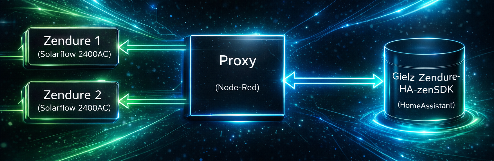
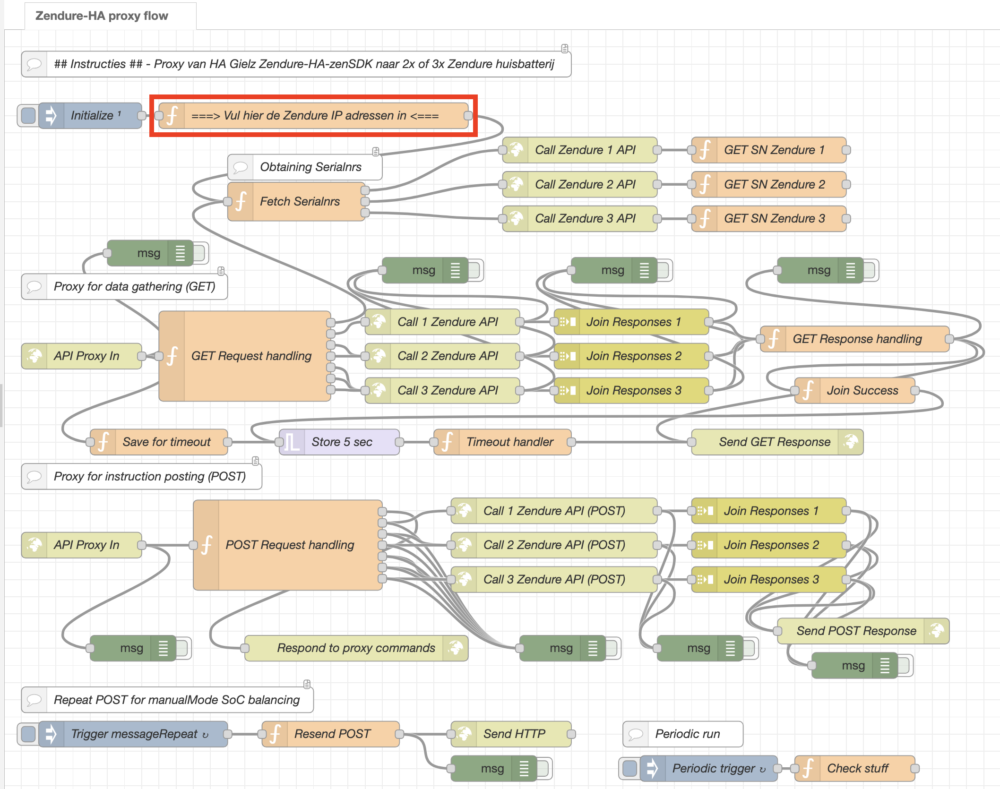
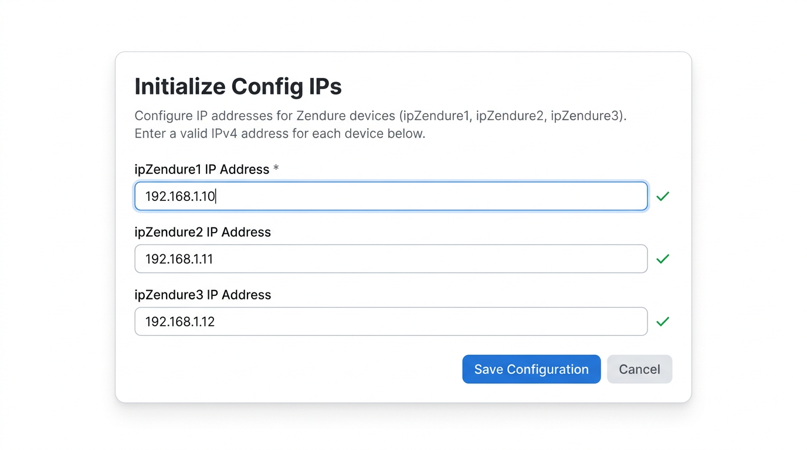

# Zendure-zenSDK-proxy


De [Gielz-automatisering](https://github.com/Gielz1986/Zendure-HA-zenSDK) voor Zendure werkt goed om een Zendure thuisbatterij (die de ZenSDK API ondersteunt) lokaal te bedienen via Home Assistant. Hierdoor is de batterij niet meer afhankelijk van een verbinding met de cloud.

Een nadeel is dat de Gielz-automatisering normaal maar één Zendure-apparaat (omvormer) tegelijk ondersteunt.

Deze Node-RED flow lost dat op. Het werkt als een tussenstation (proxy server) waarmee je twee Zendure-apparaten, bijvoorbeeld 2x [SolarFlow 2400AC](https://www.zendure.nl/products/zendure-solarflow-2400-ac), kunt aansturen alsof het één apparaat is. De flow laat ze samenwerken als een virtuele SolarFlow 4800AC.

<br/>

   

<br/>
<br/>


Het werkt als volgt: Home Assistant (HA) zal met de proxy praten, in plaats van met een Zendure. De proxy praat met de twee Zendure devices. Vanuit HA (Gielz) gezien lijkt het nog steeds alsof er maar één Zendure device is, maar dan wel eentje die twee keer zo veel vermogen aan kan (een virtuele SolarFlow 4800AC dus). De proxy verdeelt het vermogen dat HA (Gielz) aanstuurt over de twee fysieke Zendures.

Het vermogen wordt op intelligente wijze verdeeld over de Zendures. Als er een verschil is in SoC (State of Charge, batterij % Laadpercentage) van de twee Zendures, dan zal degene met de laagste SoC sneller laden of de volste juist sneller ontladen. Zo blijft de SoC van de beide Zendures dicht bij elkaar. Tevens zal bij lagere vermogens slechts één van de twee Zendures tegelijk gaan laden/ontladen, om redenen van efficiency.

Node-RED kan gemakkelijk als een Add-On geinstalleerd worden in Home Assistant. Na importeren van deze Node-RED Zendure Proxy flow, kun je de IP adressen van je twee Zendure devices invullen. Hieronder staat aangegeven waar je dat kunt doen.

Vervolgens moet je een paar eenvoudige instellingen doen voor de Gielz automatisering in Home Assistant, zoals in onderstaande instructies te zien is. Daarna kan hij aan het werk :)<br/>
<br/>


## Instructies ##

### Node-RED ###
<br/>

- [ ] Vul de IP adressen van de beide Zendure devices in, in het blok "**Vul hier de Zendure IP adressen in**" (zie het rode vierkant in het plaatjes hieronder).<br/>

Hiervoor importeer je eerst de flow Zendure-proxy-Node-Red-flow.json in Node-RED via het menu (hamburger rechtsboven) -> Import. Vervolgens open je het blok "**Vul hier de Zendure IP adressen in**" door erop te dubbel clicken. Na invullen van de IP adressen click je op "Done". Daarna click je op de "Deploy" knop rechts boven in Node-RED om de flow te activeren. Daarmee is de Node-RED kant gereed.<br/>
<br/>

 

 
<br/>
<br/>

### Home Assistant ###
<br/>

<ins>_Deze instructie gaat ervan uit dat je minimaal de Maart 2026 versie van de [Gielz ZenSDK](https://github.com/Gielz1986/Zendure-HA-zenSDK) gebruikt. Mocht je een eerdere versie gebruiken, update de Gielz dan eerst._<ins>

<br/>

- [ ] Stap 1: Op een HA Dashboard heb je als het goed is reeds het invulveld "Zendure 2400 AC IP-adres" (`input_text.zendure_2400_ac_ip_adres`) beschikbaar, als onderdeel van de Gielz instructies. Zo niet, voeg die alsnog toe. Vul het IP adres en poort van de Node-RED proxy daar in. Bijvoorbeeld: 192.168.x.x:1880


Als in de blokken "API Proxy In" staat "The url will be relative to /endpoint", dan vul hier in IP_adres:poort/endpoint 

 

Als Node-RED op de Home Assistant server zelf is geinstalleerd als Add-On, vul in "localhost:1880/endpoint".


Na deze stap zouden de sensoren van Gielz in Home Assistant al moeten werken.

<br/>

- [ ] Stap 2: Op het dashboard, stel het maximale vermogen in via de invulvelden `input_number.zendure_2400_ac_max_ontlaadvermogen` en `input_number.zendure_2400_ac_max_oplaadvermogen`.

Bijvoorbeeld voor 2x SolarFlow 2400 kun je hem op max 4800 Watt zetten.


Hiermee is de installatie gereed. Je kunt hem nu in gebruik nemen door een aansturing te kiezen op het dashboard drop-down menu `input_select.zendure_2400_ac_modus_selecteren`. Kies bijvoorbeeld "Snel opladen" om te testen of dat werkt.
<br/>
<br/>


## Node-RED als Home Assistant Add-on ##

Indien Node-RED op de Home Assistant server zelf is geinstalleerd als Add-on, volg deze stappen om de flow direct te laten werken:<br/>

1) Home Assistant Add-On Configuratie van Node-RED:
- Zet "ssl" uit
- Zet "Show unused optional configuration options" aan
- Zet "leave_front_door_open" aan
- Save de configuratie
- Herstart Node-RED<br/>

2) Op het HA Dashboard, configureer als "Zendure 2400 AC IP-adres": <br />
localhost:1880/endpoint<br/>
<br/>


## Monitoring ##

Om real-time de status van de twee Zendure devices achter de Proxy te kunnen monitoren, stuurt de Proxy behalve de bestaande attributen van de [REST API van Zendure](https://github.com/Zendure/zenSDK/blob/main/docs/en_properties.md) ook nog extra attributen mee. Deze kunnen in Home Assistant toegevoegd worden en op het dashboard geplaatst worden. Bijvoorbeeld om inzicht te hebben met welk vermogen de proxy opdracht wordt gegeven te laden/ontladen en hoe dat vervolgens over de beide Zendure devices verdeeld wordt. Of om bijvoorbeeld de SoC percentages van beide Zendure devices te kunnen zien. 

Zie hier de beschikbare extra proxy sensoren in Home Assistant.


Om deze in Home Assistant beschikbaar te maken, voegen we de extra sensoren toe aan de configuration.yaml of aan de package die [Gielz](https://github.com/Gielz1986/Zendure-HA-zenSDK) beschikbaar stelt. 

### Instructie ###

In de configuration.yaml of de package van Gielz (zendure_ha_zensdk_gielz1986.yaml) staan de volgende regels om aan de geven waar de Proxy sensoren ingevoegd kunnen worden:
```
####### BEGIN - Plaats hier je Node-RED sensoren tussen van https://github.com/gast777/Zendure-zenSDK-proxy - BEGIN #######


####### EIND - Plaats hier je Node-RED sensoren tussen van https://github.com/gast777/Zendure-zenSDK-proxy - EIND ####### 
```
Kopieer en plak de volgende sensoren tussen de aangegeven regels:
```
####### ZENDURE PROXY SENSOREN #######

      - name: "Zendure 1 Laadpercentage"
        value_template: "{{ value_json['properties']['electricLevel_1'] }}"
        device_class: battery
        unit_of_measurement: "%"
        state_class: measurement
        unique_id: Zendure_proxy_Laadpercentage_1

      - name: "Zendure 2 Laadpercentage"
        value_template: "{{ value_json['properties']['electricLevel_2'] }}"
        device_class: battery
        unit_of_measurement: "%"
        state_class: measurement
        unique_id: Zendure_proxy_Laadpercentage_2

      - name: "Vermogensopdracht"
        value_template: "{{ value_json['properties']['latestPowerCmd'] | int }}"
        unique_id: Zendure_proxy_latest_power_command
        unit_of_measurement: "W"
        state_class: measurement
        device_class: power

      - name: "Vermogensopdracht Zendure 1"
        value_template: "{{ value_json['properties']['latestPowerCmd_1'] | int }}"
        unique_id: Zendure_proxy_latest_power_command_1
        unit_of_measurement: "W"
        state_class: measurement
        device_class: power

      - name: "Vermogensopdracht Zendure 2"
        value_template: "{{ value_json['properties']['latestPowerCmd_2'] | int }}"
        unique_id: Zendure_proxy_latest_power_command_2
        unit_of_measurement: "W"
        state_class: measurement
        device_class: power

      - name: "Zendure 1 Vermogen Aansturing"
        value_template: >
          
          
          
            {{ opladen }}
          
            {{ ontladen }}
          
        unique_id: Zendure_proxy_Vermogen_Aansturing_1
        unit_of_measurement: "W"
        state_class: measurement
        device_class: power

      - name: "Zendure 2 Vermogen Aansturing"
        value_template: >
          
          
          
            {{ opladen }}
          
            {{ ontladen }}
          
        unique_id: Zendure_proxy_Vermogen_Aansturing_2
        unit_of_measurement: "W"
        state_class: measurement
        device_class: power

      - name: "Zendure 1 Kalibratie bezig"
        value_template: >
          
          
          {{ states.get(packState, "Onbekend") }}
        unique_id: Zendure_proxy_SOC_Status_1
        icon: mdi:battery-heart-variant

      - name: "Zendure 2 Kalibratie bezig"
        value_template: >
          
          
          {{ states.get(packState, "Onbekend") }}
        unique_id: Zendure_proxy_SOC_Status_2
        icon: mdi:battery-heart-variant

      - name: "Zendure 1 Opslagmodus"
        value_template: >
          
          
          {{ states.get(packState, "Onbekend") }}
        unique_id: Zendure_proxy_Opslagmodus_1
        icon: mdi:floppy

      - name: "Zendure 2 Opslagmodus"
        value_template: >
          
          
          {{ states.get(packState, "Onbekend") }}
        unique_id: Zendure_proxy_Opslagmodus_2
        icon: mdi:floppy

      - name: "Zendure Actief Device"
        value_template: >
          
          
           Geen
          
           Beide
          
           Zendure {{ active_device }}
          
        unique_id: Zendure_proxy_active_device
        icon: mdi:battery

      - name: "Zendure 1 SOC-limiet Status"
        value_template: >
          
          
          {{ states.get(packState, "Onbekend") }}
        unique_id: Zendure_proxy_soc_limiet_status_1
        icon: >
         
          mdi:battery-medium
         
          mdi:battery-high
         
          mdi:battery-low
         
          mdi:battery-outline
         

      - name: "Zendure 2 SOC-limiet Status"
        value_template: >
          
          
          {{ states.get(packState, "Onbekend") }}
        unique_id: Zendure_proxy_soc_limiet_status_2
        icon: >
         
          mdi:battery-medium
         
          mdi:battery-high
         
          mdi:battery-low
         
          mdi:battery-outline
         

      - name: "Synchroon Laden Status"
        unique_id: Zendure_proxy_equalMode
        value_template: >
          
          
            Aan
          
            Uit
          
            Onbekend
          
        icon: >
          
            mdi:battery-sync
          
            mdi:battery-sync-outline
          

      - name: "Beide Actief Status"
        unique_id: Zendure_proxy_alwaysDualMode
        value_template: >
          
          
            Aan
          
            Uit
          
            Onbekend
          
        icon: mdi:format-columns

      - name: "Zendure 1 Omvormer Temperatuur"
        value_template: >
          
          {{ (maxTemp - 2731) / 10.0 }}
        unique_id: Zendure_proxy_Omvormer_Temperatuur_1
        unit_of_measurement: "°C"
        state_class: measurement
        device_class: temperature
        icon: mdi:thermometer

      - name: "Zendure 2 Omvormer Temperatuur"
        value_template: >
          
          {{ (maxTemp - 2731) / 10.0 }}
        unique_id: Zendure_proxy_Omvormer_Temperatuur_2
        unit_of_measurement: "°C"
        state_class: measurement
        device_class: temperature
        icon: mdi:thermometer

      - name: "Zendure 1 Serienummer"
        unique_id: Zendure_proxy_Serienummer_1
        value_template: "{{ value_json.sn_1 }}"
        icon: mdi:identifier

      - name: "Zendure 2 Serienummer"
        unique_id: Zendure_proxy_Serienummer_2
        value_template: "{{ value_json.sn_2 }}"
        icon: mdi:identifier

      - name: "Zendure Proxy Versie"
        value_template: "{{ value_json.proxyVersion }}"
        unique_id: Zendure_Proxy_Versie
        icon: mdi:call-split

####### EINDE ZENDURE PROXY SENSOREN ####### 
```

Na herstart van Home Assistant kunnen deze entiteiten vervolgens aan het dashboard worden toegevoegd en gemonitord.

Om deze sensoren direct in een dasboard te krijgen, kun je een kaart toevoegen en de volgende code erin plakken:

```
type: entities
entities:
  - entity: sensor.vermogensopdracht
  - entity: sensor.vermogensopdracht_zendure_1
  - entity: sensor.vermogensopdracht_zendure_2
  - entity: sensor.zendure_1_vermogen_aansturing
  - entity: sensor.zendure_2_vermogen_aansturing
  - entity: sensor.zendure_actief_device
  - entity: sensor.zendure_1_laadpercentage
  - entity: sensor.zendure_2_laadpercentage
  - entity: sensor.zendure_1_soc_limiet_status
  - entity: sensor.zendure_2_soc_limiet_status
  - entity: sensor.zendure_1_opslagmodus
  - entity: sensor.zendure_2_opslagmodus
  - entity: sensor.zendure_1_kalibratie_bezig
  - entity: sensor.zendure_2_kalibratie_bezig
  - entity: sensor.zendure_1_omvormer_temperatuur
  - entity: sensor.zendure_2_omvormer_temperatuur
  - entity: sensor.zendure_1_serienummer
  - entity: sensor.zendure_2_serienummer
  - entity: sensor.zendure_proxy_versie
title: Zendure Proxy Sensoren
```

Nu kan het feest beginnen!

<br/>
<br/>

### Proxy attributen specificatie ###

<br/>

 | Attribuut | Beschrijving |
 |-----------|-------------|
 | `properties.electricLevel_1` | Laadpercentage van de Zendure 1 |
 | `properties.electricLevel_2` | Laadpercentage van de Zendure 2 |
 | `properties.latestPowerCmd` | Het vermogen van de meest recente opdracht aan de proxy om te laden of ontladen |
 | `properties.latestPowerCmd_1` | Het vermogen van de meest recente opdracht aan de Zendure 1 om te laden of ontladen |
 | `properties.latestPowerCmd_2` | Het vermogen van de meest recente opdracht aan de Zendure 2 om te laden of ontladen |
 | `properties.outputHomePower_1` | Vermogen uitgaand naar het net (ontladen) van Zendure 1 |
 | `properties.gridInputPower_1` | Vermogen inkomend van het net (laden) van Zendure 1 |
 | `properties.outputHomePower_2` | Vermogen uitgaand naar het net (ontladen) van Zendure 2 |
 | `properties.gridInputPower_2` | Vermogen inkomend van het net (laden) van Zendure 2 |
 | `properties.packInputPower_1` | Vermogen komend vanuit de batterijen (ontladen) van Zendure 1 |
 | `properties.outputPackPower_1` | Vermogen uitgaand naar de batterijen (laden) van Zendure 1 |
 | `properties.packInputPower_2` | Vermogen komend vanuit de batterijen (ontladen) van Zendure 2 |
 | `properties.outputPackPower_2` | Vermogen uitgaand naar de batterijen (laden) van Zendure 2 |
 | `properties.socStatus_1` | Indicatie of het Zendure 1 device geforceerd aan het opladen is vanwege kalibratie.<br/>Waarden: 0: Nee, 1: Kalibreren |
 | `properties.socStatus_2` | Indicatie of het Zendure 2 device geforceerd aan het opladen is vanwege kalibratie.<br/>Waarden: 0: Nee, 1: Kalibreren |
 | `properties.smartMode_1` | smartMode status van Zendure 1.<br/>Waarden: 0: Smartmode uit (schrijven naar Flash), 1: Smartmode aan (schrijven naar RAM) |
 | `properties.smartMode_2` | smartMode status van Zendure 2.<br/>Waarden: 0: Smartmode uit (schrijven naar Flash), 1: Smartmode aan (schrijven naar RAM) |
 | `properties.activeDevice` | Actief Device.<br/>Waarden: 0: Beide, 1: Zendure 1, 2: Zendure 2, -1: Geen |
 | `properties.alwaysDualMode` | Beide Actief. Altijd Dual Mode gebruiken. Single Mode uitgeschakeld.<br/>Waarden: 0: Uit, 1: Aan (read/write) |
 | `properties.equalMode` | Synchroon Laden. Altijd Dual Mode gebruiken en steeds hetzelfde vermogen op beide devices.<br/>Waarden: 0: Uit, 1: Aan (read/write) |
 | `properties.socLimit_1` | SOC-limiet Status van het Zendure 1 device.<br/>Waarden: 0: Normale werking, 1: Oplaadlimiet bereikt, 2: Ontlaadlimiet bereikt |
 | `properties.socLimit_2` | SOC-limiet Status van het Zendure 2 device.<br/>Waarden: 0: Normale werking, 1: Oplaadlimiet bereikt, 2: Ontlaadlimiet bereikt |
 | `properties.hyperTmp_1` | Omvormertemperatuur van het Zendure 1 device. |
 | `properties.hyperTmp_2` | Omvormertemperatuur van het Zendure 2 device. |
 | `sn_1` | Serienummer van de omvormer van het Zendure 1 device. |
 | `sn_2` | Serienummer van de omvormer van het Zendure 2 device. |
 | `proxyVersion` | Versie van de Proxy. |
<br/>
<br/>

<details>
<summary>Optioneel: Nog meer per device monitoren? Open dan deze sectie.</summary>

      
### Optioneel: Nog meer per device monitoren? ###

Het is onwaarschijnlijk, maar zou je nog meer details per device willen monitoren, die niet per device door de proxy worden doorgegeven en die minder real-time hoeven te zijn? Dan kun je eenvoudig een minder frequente REST polling toevoegen in je configuration.yaml (of in een aparte package, niet in de Gielz package). Deze verbindt rechtstreeks naar de Zendure devices IP adressen, dus niet via de proxy.<br/>

<br/>
Voorbeeld:
<br/>

```
rest:

  - resource: http://192.168.x.x/properties/report
    scan_interval: 120
    sensor:

      - name: "Zendure 1 Signaalsterkte"
        value_template: >
          
          
            Uitstekend
          
            Goed
          
            Zwak
          
            Slecht
          
        unique_id: Zendure_1_Signaalsterkte
        icon: mdi:wifi

      - name: "Zendure 1 Error"
        value_template: >
          
          
          {{ states.get(packState, "Onbekend") }}
        unique_id: Zendure_1_Error
        icon: mdi:battery-alert


  - resource: http://192.168.x.y/properties/report
    scan_interval: 120
    sensor:

      - name: "Zendure 2 Signaalsterkte"
        value_template: >
          
          
            Uitstekend
          
            Goed
          
            Zwak
          
            Slecht
          
        unique_id: Zendure_2_Signaalsterkte
        icon: mdi:wifi

      - name: "Zendure 2 Error"
        value_template: >
          
          
          {{ states.get(packState, "Onbekend") }}
        unique_id: Zendure_2_Error
        icon: mdi:battery-alert
        
```
NB: voeg geen hoog frequente polling toe, om de Zendure devices niet te overbelasten met te veel verzoeken.
<br/>
<br/>
NB: van de attributen in bovenstaand voorbeeld wordt reeds de laagste (slechtste) waarde van de beide devices door de proxy doorgegeven in het reguliere attribuut (rssi / is_error) van het virtuele device. Dus als er een probleem is, zul je dat ook zonder deze extra configuratie kunnen zien.


<br/>
<br/>

**Tip**: om te zien welke attributen er beschikbaar zijn om te monitoren, kun je in Node-RED de debug node (groen blokje) even aanzetten die verbonden is met het blok "Join Responses" of "Call Zendure 1 API". Vervolgens verschijnen de messages rechts in het debug venster (de tab met het kevertje). Deze messages kun je uitvouwen om te zien welke informatie erin meegestuurd wordt.
<br/>
<br/>
</details>

<details>
<summary>Optioneel: Voor de features Beide Actief en Synchroon Laden, open deze sectie.</summary>


### Optioneel: Beide Actief en Synchroon Laden ###

Met de instelling _Beide Actief_ ingeschakeld zullen beide Zendures actief blijven, dus altijd in dual mode blijven. 
De instelling _Synchroon Laden_ is hetzelfde als _Beide Actief_ maar waarbij dan ook nog de beide Zendure devices steeds met hetzelfde vermogen opladen of ontladen.

Deze twee features zullen niet zinvol zijn voor 99% van de gebruikers. Echter in bepaalde gevallen zou het wenselijk kunnen zijn om deze mogelijkheden te hebben.

Deze twee instellingen kunnen eenvoudig bediend worden via een toggle switch op het dashboard.
<br/>
<br/>


<br/>
<br/>
Hoe te installeren:

1) De REST sensoren van [Monitoring](https://github.com/gast777/Zendure-zenSDK-proxy/tree/main?tab=readme-ov-file#monitoring) moeten geinstalleerd zijn in de Gielz package of in de configuration.yaml. Het handigst is om de Gielz Package te gebruiken. Zie de [instructie van Gielz](https://github.com/Gielz1986/Zendure-HA-zenSDK/tree/main?tab=readme-ov-file#%EF%B8%8F%E2%83%A3-configuratie-en-herstart) hoe die te installeren.
2) Voeg de volgende items toe aan configuration.yaml (niet aan de Gielz package, kan wel in een aparte package).

```

template:

  - switch:

      - name: "Beide Actief"
        unique_id: Zendure_proxy_alwaysDualMode_switch
        state: >
          {{ is_state('sensor.beide_actief_status', 'Aan') }}
        icon: mdi:format-columns
        turn_on:
          - service: rest_command.set_alwaysdualmode_on
        turn_off:
          - service: rest_command.set_alwaysdualmode_off

      - name: "Synchroon Laden"
        unique_id: Zendure_proxy_equalMode_switch
        state: >
          {{ is_state('sensor.synchroon_laden_status', 'Aan') }}
        icon: >
          
            mdi:battery-sync
          
            mdi:battery-sync-outline
          
        turn_on:
          - service: rest_command.set_equalmode_on
        turn_off:
          - service: rest_command.set_equalmode_off


rest_command:

  set_alwaysdualmode_on:
    url: http://{{ states('input_text.zendure_2400_ac_ip_adres') }}/properties/write
    method: POST
    content_type: "application/json"
    payload: >
      {
        "properties": {
          "alwaysDualMode": {{ 1 }}
        }
      }

  set_alwaysdualmode_off:
    url: http://{{ states('input_text.zendure_2400_ac_ip_adres') }}/properties/write
    method: POST
    content_type: "application/json"
    payload: >
      {
        "properties": {
          "alwaysDualMode": {{ 0 }}
        }
      }

  set_equalmode_on:
    url: http://{{ states('input_text.zendure_2400_ac_ip_adres') }}/properties/write
    method: POST
    content_type: "application/json"
    payload: >
      {
        "properties": {
          "equalMode": {{ 1 }}
        }
      }

  set_equalmode_off:
    url: http://{{ states('input_text.zendure_2400_ac_ip_adres') }}/properties/write
    method: POST
    content_type: "application/json"
    payload: >
      {
        "properties": {
          "equalMode": {{ 0 }}
        }
      }
```

3) Herstart Home Assistant
4) Zet de toggle switches `switch.beide_actief` en `switch.synchroon_laden` op je dashboard.

Als je nu de switch _Beide Actief_ aan zet, zullen beide Zendures actief blijven. Als de switch _Synchroon Laden_ aangezet wordt, zullen beide Zendures ook steeds met hetzelfde vermogen laden en ontladen.

</details>


<br/>
<br/>


## Features ##
- SoC balancering - De SoC (state of charge, laadpercentage) van de twee devices wordt dicht bij elkaar gehouden doordat de volste batterij het snelst ontlaadt en de leegste batterij het snelst oplaadt. Bij gelijke SoC laden ze beide even snel.
- Herhaling van instructies om te laden/ontladen, zodat SoC balancing tussen de Zendures ook werkt voor Handmatige mode.
- Single Mode - Bij lagere vermogens laadt/ontlaadt slechts een van de Zendures tegelijk. Dit wordt afgewisseld aan de hand van de SoC van de beide devices, waardoor de SoC waardes gebalanceerd blijven.
- In Single Mode wordt het passieve device (degene die op dat moment niet laadt of ontlaadt) na 5 minuten op standby gezet (smartMode = 0, "Opslaan in Flash").
- In Single Mode wordt naar het andere device overgeschakeld wanneer het verschil in SoC 5% is. Hierdoor wordt minder vaak overgeschakeld van actief device.
- Bij het overschakelen naar het andere device of van Single Mode naar Dual Mode overschakelen, worden tijdens de overgangsperiode twee devices gebruikt. In het begin krijgt het reeds actieve device 95% van het vermogen toebedeeld, zodat de andere de tijd krijgt om op te starten, voordat die meer vermogen toebedeeld krijgt.
<br/>

## Vereisten ## 
- 2x Zendure SolarFlow 2400 AC (2x Zendure SolarFlow 800 Plus/Pro, SolarFlow 1600 AC+ of SolarFlow 2400 AC+/Pro zijn ook compatibel, nog niet getest).
- Zorg dat op beide Zendures hetzelfde maximale en minimale laadpercentage (SoC percentages) ingesteld staan.
- Beide Zendures moeten hetzelfde aantal batterijen hebben.
- De beide Zendures en de Node-RED server moeten een vast IP adres hebben.
- Beide Zendures moeten beschikbaar zijn en werken.
<br/>

## Beperkingen ##
- Zonnepanelen direct via DC aangesloten op de Zendures zijn niet ondersteund/getest.
- Bij een instructie van 0 Watt laden levert een Zendure device soms rond de 20 Watt. Dit is momenteel Zendure gedrag en geen probleem. Dit wordt op 0 gezet zodra het passieve device automatisch op standby gezet wordt (smartMode = 0, "Opslaan in Flash").
- Met Node-RED 4.0.9 zijn er door een gebruiker problemen gerapporteerd, die met versie 4.1.2 niet meer optraden (thanks [Freemann](https://tweakers.net/gallery/45846/)). Node-RED versie 4.1.1 en 4.1.4 zijn ook getest en werken prima.
<br/>


## Versie ##

Huidige versie: 20260228
<br/>

# Release-notes #

## Nieuw in versie 20260201 ##

- De product string die via de GET requests wordt doorgegeven aan Home Assistant (in properties.product) zal nu in plaats van "PROXY-NODE-RED" de daadwerkelijke product string van de Zendure devices zijn, zoals "solarFlow2400AC". Deze verandering is nodig omdat vanaf de Gielz Maart 2026 versie deze string gebruikt zal worden om de capaciteit van de batterijen te bepalen.
- Het maximale vermogen dat aan de devices gevraagd zal worden, wordt nu automatisch aangepast aan het ingestelde Max. Oplaadvermogen en Max. Ontlaadvermogen. Dit kan nu afwijken van 4800 Watt. Als bijvoorbeeld 3600 Watt als Max. Oplaadvermogen wordt ingesteld, zal op beide Zendure devices 1800 Watt (ieder de helft) ingesteld worden. Ook zal de proxy dan maximaal 1800 Watt aan ieder device vragen te laden en daarmee rekening houden bij het verdelen van het vermogen.
- Het Max. Oplaadvermogen en Max. Ontlaadvermogen kunnen nu verschillend zijn en de proxy zal daar rekening mee houden.
- Als het Max. Oplaadvermogen en Max. Ontlaadvermogen verschillend zijn, zal ook het absolute vermogen afgeleid van de singleMode_upperlimit_percent en singleMode_lowerlimit_percent verschillend zijn. De limieten zijn standaard respectievelijk 100% en 40% van het max vermogen voor opladen of ontladen. De absolute waarden zullen nu dus per richting kunnen verschillen met het max vermogen. Deze bepalen waneer er wordt omgeschakeld tussen 1 of 2 devices tegelijk gebruiken om te laden/ontladen.
- Als het het Max. Oplaadvermogen of Max. Ontlaadvermogen op de beide Zendure devices niet hetzelfde is ingesteld, zal er nu een waarschuwing gelogd worden in Node-RED.

## Nieuw in versie 20260206 ##

- In Node-RED wordt nu een duidelijke waarschuwing in het debug venster gegeven als de twee Zendure devices niet hetzelfde ingesteld zijn wat betreft Minimale/Maximale Laadpercentage (SoC%) of Minimale/Maximale Oplaadvermogen/Ontlaadvermogen. Om onnodige meldingen te voorkomen op het moment van aanpassen van deze instellingen, verschijnen deze logs niet direct, maar pas als de error situatie een tijdje aanwezig is.
- Kleine optimalisaties in gedrag.

## Nieuw in versie 20260209 ##
- Vanaf nu worden de omvormertemperatuur en de serienummers van de beide Zendures standaard meegestuurd via de REST API en zijn dus beschikbaar in Home Assistant. Ook zijn de sensoren daarvoor toegevoegd aan de lijst onder [Monitoring](https://github.com/gast777/Zendure-zenSDK-proxy/tree/main?tab=readme-ov-file#monitoring).

## Nieuw in versie 20260211 ##
- Enkele checks toegevoegd om nuttige foutmeldingen te kunnen geven wanneer nodig.
- Instructies blok up-to-date gebracht en vereenvoudigd.

## Nieuw in versie 20260212 ##
- _Actief Device_ toont nu _Geen_ wanneer de huidige vermogensopdracht nul is. Om dit correct te tonen in Home Assistant is ook de REST sensor "Zendure Actief Device" aangepast. De nieuwe benodigde REST sensor configuratie is hierboven te zien onder [Monitoring](https://github.com/gast777/Zendure-zenSDK-proxy/tree/main?tab=readme-ov-file#monitoring).

## Nieuw in versie 20260213 ##
- Vanaf deze versie hoeven de serienummers niet meer te worden ingevuld bij installatie van de Node-RED flow. Alleen de beide IP adressen moeten ingevuld worden. Node-RED zal nu zelf de serienummers van de twee Zendures uitlezen en gebruiken.

## Nieuw in versie 20260215 ##
- "Zendure 1 Vermogen Aansturing" en "Zendure 2 Vermogen Aansturing" zijn nu toegevoegd aan de sensoren voor Home Assistant, zie [Monitoring](https://github.com/gast777/Zendure-zenSDK-proxy/tree/main?tab=readme-ov-file#monitoring).
- De outputPackPower en packInputPower wordt nu voor beide Zendures meegestuurd door de proxy.

## Nieuw in versie 20260217 ##
- Ondersteuning toegevoegd voor "Synchroon Laden". Daarmee kan indien gewenst geforceerd worden dat beide Zendure devices steeds met hetzelfde vermogen laden.

## Nieuw in versie 20260219 ##
- Issue opgelost waarbij de overgang van single mode naar dual mode niet vloeiend verliep
- Kleine verbeteringen

## Nieuw in versie 20260220 ##
- Vanaf deze versie worden de Zendure attributen _outputHomePower_ en _gridInputPower_ doorgegeven.
- Ondersteuning toegevoegd voor "Beide Actief". Daarmee kan indien gewenst geforceerd worden dat altijd beide Zendure devices actief zijn, dus altijd dual mode gebruiken. Ze kunnen daarbij nog wel verschillende vermogens hebben, om de Laadpercentages bij elkaar in de buurt te houden.

## Nieuw in versie 20260223 ##
- Het versienummer van de Proxy wordt nu via de REST naar Home Assistant gestuurd. De REST sensor voor Home Assistant om de huidige Proxy versie (sensor.zendure_proxy_versie) te kunnen zien is toegevoegd aan de lijst onder [Monitoring](https://github.com/gast777/Zendure-zenSDK-proxy/tree/main?tab=readme-ov-file#monitoring).

## Nieuw in versie 20260228 ##
- Nu worden ook de Zendure attributen _outputHomePower_ en _gridInputPower_ ook afzonderlijk voor ieder device doorgegeven via _gridInputPower_1_ / _gridInputPower_2_ en _outputHomePower_1_ / _outputHomePower_2_. Deze worden nu gebruikt voor de Home Assistant sensoren "Zendure 1 Vermogen Aansturing" en "Zendure 2 Vermogen Aansturing", zie [Monitoring](https://github.com/gast777/Zendure-zenSDK-proxy/tree/main?tab=readme-ov-file#monitoring).
- De berekening van electricLevel (SoC %) die wordt doorgegeven aan Home Assistant is geoptimaliseerd voor een specifieke situatie. Wanneer een van de twee Zendures ruim onder de minSoc zit en de andere erboven, dan zou niet verder ontladen worden en minSoc niet bereikt worden op de hoogste van de twee. Om dat op te lossen wordt nu in de berekening van de totale SoC (electricLevel) de laagste van de twee SoC waarden vervangen door de minSoc waarde. Het gemiddelde dat doorgegeen wordt aan HA als electricLevel zal dan nog boven minSoc zijn en de hoogste Zendure zal dan toch verder ontladen en netjes op minSoc terecht komen. Degene die onder minSoc zit, zal dan (eventueel later) door de Gielz SoC bescherming ook weer netjes naar het minSoc niveau gebracht worden. De SoC waarden voor de individuele Zendures (Zendure 1 Laadpercentage / Zendure 2 Laadpercentage) zullen wel altijd de werkelijke waarde blijven doorgeven en tonen in Home Assistant.

