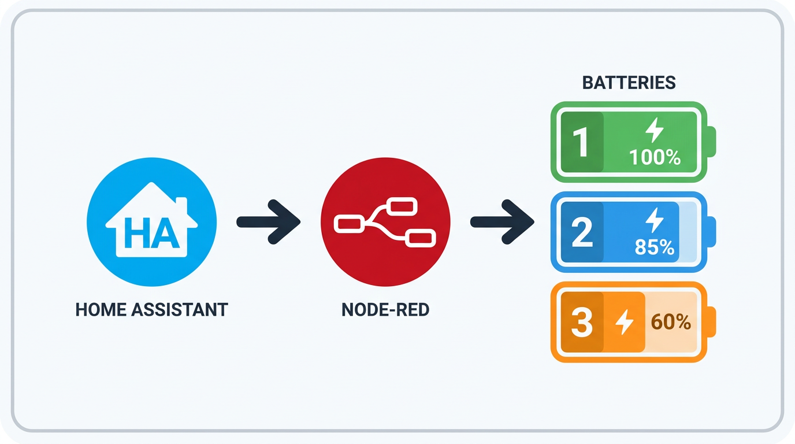

# Zendure-zenSDK-proxy

versie 20251128


## Instructies ##

De Gielz automatisering voor Zendure ( https://github.com/Gielz1986/Zendure-HA-zenSDK ) werkt heel goed om een Zendure thuisbatterij die de ZenSDK API ondersteunt, lokaal aan te sturen, waarbij geen cloud communicatie nodig is. Een beperking van de Gielz automatisering is echter dat die slechts 1 Zendure device (omvormer) ondersteunt.

Deze Node-Red flow vormt een proxy server die het mogelijk maakt de Gielz automatisering te gebruiken met twee Zendure devices, zoals 2x Solarflow 2400AC.


   


Na importeren van deze Node-Red flow in je Node-Red server, kun je de IP adressen en de serienummers van je twee Zendure devices invullen. Hieronder staat aangegeven waar je dat kunt doen.

Vervolgens moet je ook een paar kleine aanpassingen doen in de Gielz automatisering in HomeAssistant. 


### Node-Red ###

- Vul in het blok "Vul hier de Zendure IP adressen en serienummers in" de IP adressen en de serienummers van de Zendure devices in.


 


### HomeAssistant ###

- Op het HA Dashboard, vul het IP adres en poort van de Node-Red proxy in voor "Zendure 2400 AC IP-adres" (input_text.zendure_2400_ac_ip_adres). Bijvoorbeeld: 192.168.x.x:1880

 

Als in de blokken "API Proxy In" staat "The url will be relative to /endpoint", dan vul hier in IP_adres:poort/endpoint 

 

Als Node-Red op de HomeAssistant server zelf is geinstalleerd als Add-On, vul in "localhost:1880/endpoint".

 


Oudere versies: In configuration.yaml, vul het IP adres en poort van de Node-Red HTTP proxy in op de plaats van het 2400 AC device IP adres.

- In configuration.yaml, onder alle rest_command items, voeg deze HTTP regels toe:
```
    headers:
      Content-Type: application/json
      Content-Encoding: identity
```

Voorbeeld:
```
  zendure_stop_met_ontladen:
    url: http://{{ states('input_text.zendure_2400_ac_ip_adres') }}/properties/write
    method: POST
    headers:
      Content-Type: application/json
      Content-Encoding: identity
    payload: '{"sn":"{{sn}}","properties":{"acMode": 2, "outputLimit": 0 }}'
```

Hiermee wordt de json content niet gecomprimeerd door HA en kan de Node-Red HTTP-in node het lezen. Zonder deze aanpassing zullen de POST opdrachten niet werken.

- In configuration.yaml, verander hier de "min: -2400" en "max: 2400" naar "min: -4800" en "max 4800":
```
input_number:
  zendure_2400_ac_handmatig_vermogen:
    name: Zendure 2400 AC Handmatig Vermogen
    min: -2400     <<<< verander naar -4800
    max: 2400      <<<< verander naar 4800
    step: 1
    mode: box
    unit_of_measurement: "W"
```
Daarmee kun je handmatig laden/leveren tot 4800W in plaats van 2400W.

- In automations.yaml, zoek en vervang alle
```
cap = 2400
```
door
```
cap = 4800
```
Hiermee wordt het maximale vermogen verhoogd naar het maximale wat de 2x SolarFlow 2400AC's (oftewel een virtuele SolarFlow 4800AC) aankunnen.


## Node-Red als HomeAssistant Add-on ##

Indien Node-Red op de HomeAssistant server zelf is geinstalleerd als Add-on, volg deze stappen om de flow direct te laten werken:

1) HomeAssistant Add-On Configuratie van Node-Red:
- Zet "ssl" uit
- Zet "Show unused optional configuration options" aan
- Zet "leave_front_door_open" aan
- Save de configuratie
- Herstart Node-Red

2) Op het HA Dashboard, configureer als "Zendure 2400 AC IP-adres": <br />
localhost:1880/endpoint


## Features ##
- SoC balancering - De SoC (state of charge) van de twee devices wordt dicht bij elkaar gehouden doordat de volste batterij het snelst ontlaadt en de leegste batterij het snelst oplaadt. Bij gelijke SoC laden ze beide even snel.
- Herhaling van instructies om te laden/ontladen, zodat SoC balancing tussen de Zendures ook werkt voor Handmatige mode.
- Single Mode - Bij lagere vermogens laadt/ontlaadt slechts een van de Zendures tegelijk. Dit wordt afgewisseld aan de hand van de SoC van de beide devices, waardoor de SoC waardes gebalanceerd blijven.
- In Single Mode overschakelen naar ander device laden/ontladen bij meer dan 1% punt verschil in SoC (standaard bij 2% verschil). Hierdoor wordt minder vaak overgeschakeld.

## Vereisten ## 
- 2x Zendure SolarFlow 2400 AC (2x Zendure SolarFlow 800 Pro zal ook werken als je "let maxPower = 2400" verandert naar "let maxPower = 800" in het blok "Vul hier de Zendure IP adressen en serienummers in").
- Zorg dat op beide Zendures hetzelfde maximale en minimale laadpercentage (SoC percentages) ingesteld staan.
- Beide Zendures moeten hetzelfde aantal batterijen hebben.
- De beide Zendures en de Node-Red server moeten een vast IP adres hebben.
- Beide Zendures moeten beschikbaar zijn en werken.


