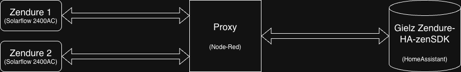
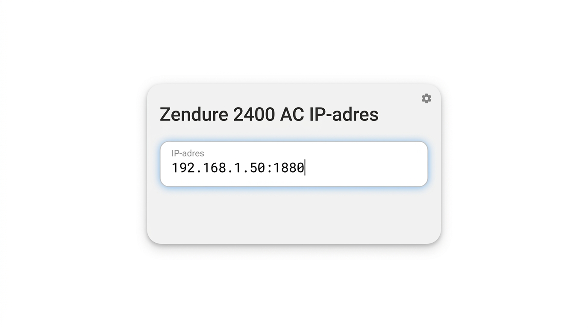
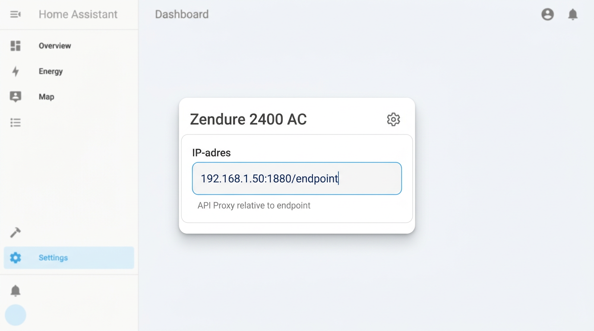
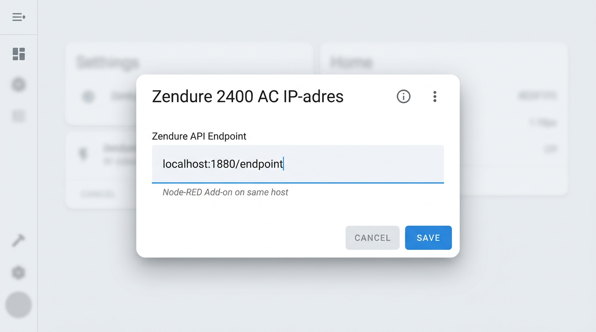
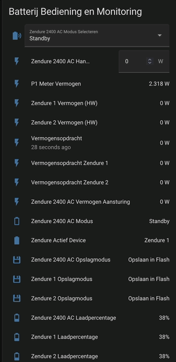

# Zendure-zenSDK-proxy

versie 20260206


## Instructies ##

De Gielz automatisering voor Zendure ( https://github.com/Gielz1986/Zendure-HA-zenSDK ) werkt heel goed om een Zendure thuisbatterij die de ZenSDK API ondersteunt, lokaal aan te sturen, waarbij geen cloud communicatie nodig is. Een beperking van de Gielz automatisering is echter dat die slechts 1 Zendure device (omvormer) ondersteunt.

Deze Node-Red flow vormt een proxy server die het mogelijk maakt de Gielz automatisering te gebruiken met twee Zendure devices, zoals 2x SolarFlow 2400AC. De proxy simuleert dan een virtuele SolarFlow 4800AC.

<br/>

   

<br/>
<br/>


Het werkt als volgt: De HA (Gielz) zal met de proxy praten, in plaats van met een Zendure. De proxy praat met de twee Zendure devices. Vanuit HA (Gielz) gezien lijkt het nog steeds alsof er maar 1 Zendure device is, maar dan wel eentje die twee keer zo veel vermogen aan kan (een virtuele SolarFlow 4800AC dus). De proxy verdeelt het vermogen dat HA (Gielz) aanstuurt over de twee fysieke Zendures.

Het vermogen wordt op intelligente wijze verdeeld over de Zendures. Als er een verschil is in SoC (State of Charge, batterij % Laadpercentage) van de twee Zendures, zal degene met het laagste SoC sneller laden of de volste juist sneller ontladen. Zo blijft de de SoC van de beide Zendures dicht bij elkaar. Tevens zal bij lagere vermogens slechts 1 van de twee Zendures tegelijk gaan laden/ontladen, om redenen van efficiency.

Node-Red kan gemakkelijk als een Add-On geinstalleerd worden in HomeAssistant. Na importeren van deze Node-Red Zendure Proxy flow in je Node-Red server, kun je de IP adressen en de serienummers van je twee Zendure devices invullen. Hieronder staat aangegeven waar je dat kunt doen.

Vervolgens moet je een paar eenvoudige instellingen doen voor de Gielz automatisering in HomeAssistant, zoals in onderstaande instructies te zien is. Daarna kan hij aan het werk :)<br/>
<br/>

### Node-Red ###
<br/>

- [ ] Vul in het blok "Vul hier de Zendure IP adressen en serienummers in" de IP adressen en de serienummers van de Zendure devices in.<br/>
<br/>

 

<br/>

### HomeAssistant ###
<br/>

<ins>_Deze instructie gaat ervan uit dat je minimaal de Februari 2026 versie van de Gielz ZenSDK gebruikt. Mocht je een eerdere versie gebruiken, update de Gielz dan eerst._<ins>

<br/>

- [ ] Op een HA Dashboard heb je als het goed is reeds het invulveld "Zendure 2400 AC IP-adres" beschikbaar, als onderdeel van de Gielz instructies. Zo niet, voeg die alsnog toe. Vul het IP adres en poort van de Node-Red proxy in voor "Zendure 2400 AC IP-adres" (input_text.zendure_2400_ac_ip_adres). Bijvoorbeeld: 192.168.x.x:1880

 

Als in de blokken "API Proxy In" staat "The url will be relative to /endpoint", dan vul hier in IP_adres:poort/endpoint 

 

Als Node-Red op de HomeAssistant server zelf is geinstalleerd als Add-On, vul in "localhost:1880/endpoint".

 


<br/>

- [ ] In automations.yaml, zoek en vervang alle

```
cap = 2400
```
door
```
cap = 4800
```

Hiermee wordt het maximale vermogen verhoogd naar het maximale wat de 2x SolarFlow 2400AC's (oftewel een virtuele SolarFlow 4800AC) aankunnen.

<ins>_NB: vanaf de Maart 2026 versie van de Gielz ZenSDK is deze stap niet meer nodig.<br/>In plaats daarvan kan het maximale vermogen ingesteld worden op het dashboard via de invulvelden `input_number.zendure_2400_ac_max_ontlaadvermogen` en `input_number.zendure_2400_ac_max_oplaadvermogen`._</ins>

<br/>


## Node-Red als HomeAssistant Add-on ##

Indien Node-Red op de HomeAssistant server zelf is geinstalleerd als Add-on, volg deze stappen om de flow direct te laten werken:<br/>

1) HomeAssistant Add-On Configuratie van Node-Red:
- Zet "ssl" uit
- Zet "Show unused optional configuration options" aan
- Zet "leave_front_door_open" aan
- Save de configuratie
- Herstart Node-Red<br/>

2) Op het HA Dashboard, configureer als "Zendure 2400 AC IP-adres": <br />
localhost:1880/endpoint<br/>
<br/>


## Monitoring ##

Om real-time de status van de twee Zendure devices achter de Proxy te kunnen monitoren, stuurt de Proxy behalve de bestaande attributen van de [REST API van Zendure](https://github.com/Zendure/zenSDK/blob/main/docs/en_properties.md) ook nog extra attributen mee. Deze kunnen in HomeAssistant toegevoegd worden en op het dashboard geplaatst worden. Bijvoorbeeld om inzicht te hebben met welk vermogen de proxy opdracht wordt gegeven te laden/ontladen en hoe dat vervolgens over de beide Zendure devices verdeeld wordt. Of om bijvoorbeeld de SoC percentages van beide Zendure devices te kunnen zien. 

De Node-Red proxy voegt deze nieuwe attributen toe aan de bestaande reply messages op de GET requests, die elke seconde gedaan worden door de Gielz REST configuratie.

De toegevoegde attributen zijn als volgt.<br/>

 | Attribuut | Beschrijving |
 |-----------|-------------|
 | `properties.electricLevel_1` | Laadpercentage van de Zendure 1 |
 | `properties.electricLevel_2` | Laadpercentage van de Zendure 2 |
 | `properties.latestPowerCmd` | Het vermogen van de meest recente opdracht aan de proxy om te laden of ontladen |
 | `properties.latestPowerCmd_1` | Het vermogen van de meest recente opdracht aan de Zendure 1 om te laden of ontladen |
 | `properties.latestPowerCmd_2` | Het vermogen van de meest recente opdracht aan de Zendure 2 om te laden of ontladen |
 | `properties.socStatus_1` | Indicatie of het Zendure 1 device geforceerd aan het opladen is vanwege kalibratie.<br/>Waarden: 0: Nee, 1: Kalibreren |
 | `properties.socStatus_2` | Indicatie of het Zendure 2 device geforceerd aan het opladen is vanwege kalibratie.<br/>Waarden: 0: Nee, 1: Kalibreren |
 | `properties.smartMode_1` | smartMode status van Zendure 1.<br/>Waarden: 0: Smartmode uit (schrijven naar Flash), 1: Smartmode aan (schrijven naar RAM) |
 | `properties.smartMode_2` | smartMode status van Zendure 2.<br/>Waarden: 0: Smartmode uit (schrijven naar Flash), 1: Smartmode aan (schrijven naar RAM) |
 | `properties.activeDevice` | Actief device.<br/>Waarden: 0: Beide, 1: Zendure 1, 2: Zendure 2 |
 | `properties.socLimit_1` | SOC-limiet Status van het Zendure 1 device.<br/>Waarden: 0: Normale werking, 1: Oplaadlimiet bereikt, 2: Ontlaadlimiet bereikt |
 | `properties.socLimit_2` | SOC-limiet Status van het Zendure 2 device.<br/>Waarden: 0: Normale werking, 1: Oplaadlimiet bereikt, 2: Ontlaadlimiet bereikt |
<br/>


Om deze in HomeAssistant te monitoren, voeg het volgende toe aan configuration.yaml. Daarna kunnen deze toegevoegd worden aan een dashboard.

Onder deze bestaande REST configuratie van Gielz:
```
rest:
  - resource_template: "http://{{ states('input_text.zendure_2400_ac_ip_adres') }}/properties/report"
    scan_interval: 1
    sensor:
```
Voeg de volgende sensoren toe:
```
####### Hieronder niet verwijderen bij upgrade van Gielz

####### ZENDURE PROXY SENSOREN ####### 
      - name: "Zendure 1 Laadpercentage"
        value_template: "{{ value_json['properties']['electricLevel_1'] }}"
        device_class: battery
        unit_of_measurement: "%"
        state_class: measurement
        unique_id: Zendure_proxy_Laadpercentage_1

      - name: "Zendure 2 Laadpercentage"
        value_template: "{{ value_json['properties']['electricLevel_2'] }}"
        device_class: battery
        unit_of_measurement: "%"
        state_class: measurement
        unique_id: Zendure_proxy_Laadpercentage_2

      - name: "Vermogensopdracht"
        value_template: "{{ value_json['properties']['latestPowerCmd'] | int }}"
        unique_id: Zendure_proxy_latest_power_command
        unit_of_measurement: "W"
        state_class: measurement
        device_class: power

      - name: "Vermogensopdracht Zendure 1"
        value_template: "{{ value_json['properties']['latestPowerCmd_1'] | int }}"
        unique_id: Zendure_proxy_latest_power_command_1
        unit_of_measurement: "W"
        state_class: measurement
        device_class: power

      - name: "Vermogensopdracht Zendure 2"
        value_template: "{{ value_json['properties']['latestPowerCmd_2'] | int }}"
        unique_id: Zendure_proxy_latest_power_command_2
        unit_of_measurement: "W"
        state_class: measurement
        device_class: power

      - name: "Zendure 1 Kalibratie bezig"
        value_template: >
          
          
          {{ states.get(packState, "Onbekend") }}
        unique_id: Zendure_proxy_SOC_Status_1
        icon: mdi:battery-heart-variant

      - name: "Zendure 2 Kalibratie bezig"
        value_template: >
          
          
          {{ states.get(packState, "Onbekend") }}
        unique_id: Zendure_proxy_SOC_Status_2
        icon: mdi:battery-heart-variant

      - name: "Zendure 1 Opslagmodus"
        value_template: >
          
          
          {{ states.get(packState, "Onbekend") }}
        unique_id: Zendure_proxy_Opslagmodus_1
        icon: mdi:floppy

      - name: "Zendure 2 Opslagmodus"
        value_template: >
          
          
          {{ states.get(packState, "Onbekend") }}
        unique_id: Zendure_proxy_Opslagmodus_2
        icon: mdi:floppy

      - name: "Zendure Actief Device"
        value_template: >
          
          
           Beide
          
           Zendure 1
          
           Zendure 2
          
        unique_id: Zendure_proxy_active_device
        icon: mdi:battery

      - name: "Zendure 1 SOC-limiet Status"
        value_template: >
          
          
          {{ states.get(packState, "Onbekend") }}
        unique_id: Zendure_proxy_soc_limiet_status_1
        icon: >
         
          mdi:battery-medium
         
          mdi:battery-high
         
          mdi:battery-low
         
          mdi:battery-outline
         

      - name: "Zendure 2 SOC-limiet Status"
        value_template: >
          
          
          {{ states.get(packState, "Onbekend") }}
        unique_id: Zendure_proxy_soc_limiet_status_2
        icon: >
         
          mdi:battery-medium
         
          mdi:battery-high
         
          mdi:battery-low
         
          mdi:battery-outline
         

####### EINDE ZENDURE PROXY SENSOREN ####### 

```

Deze entiteiten kunnen vervolgens aan het dashboard worden toegevoegd en gemonitord zoals in het volgende voorbeeld.

 


<br/>
<br/>
**Tip**: Om andere gegevens van de individuele Zendure devices uit te lezen, die minder real-time hoeven te zijn, kun je een minder frequente REST polling toevoegen, rechtstreeks naar de Zendure devices IP adressen.<br/>
<br/>
Voorbeeld:
<br/>

```
rest:
<..snip..>

  - resource: http://192.168.x.x/properties/report
    scan_interval: 60
    sensor:

      - name: "Zendure 1 Omvormer Serienummer"
        unique_id: Zendure_1_Omvormer_Serienummer
        value_template: "{{ value_json.sn }}"

      - name: "Zendure 1 Omvormer Temperatuur"
        value_template: >
          
          {{ (maxTemp - 2731) / 10.0 }}
        unique_id: Zendure_1_Omvormer_Temperatuur
        unit_of_measurement: "°C"
        state_class: measurement
        device_class: temperature
        icon: mdi:thermometer


  - resource: http://192.168.x.y/properties/report
    scan_interval: 60
    sensor:

      - name: "Zendure 2 Omvormer Serienummer"
        unique_id: Zendure_2_Omvormer_Serienummer
        value_template: "{{ value_json.sn }}"

      - name: "Zendure 2 Omvormer Temperatuur"
        value_template: >
          
          {{ (maxTemp - 2731) / 10.0 }}
        unique_id: Zendure_2_Omvormer_Temperatuur
        unit_of_measurement: "°C"
        state_class: measurement
        device_class: temperature
        icon: mdi:thermometer

        
```
<br/>
**Tip**: om te zien welke attributen er beschikbaar zijn om te monitoren, kun je in Node-Red de debug node (groen blokje) even aanzetten die verbonden is met het blok "GET Response handling". Vervolgens verschijnen de messages rechts in het debug venster (de tab met het kevertje). Deze messages kun je uitvouwen om te zien welke informatie erin meegestuurd wordt.
<br/>
<br/>

## Features ##
- SoC balancering - De SoC (state of charge) van de twee devices wordt dicht bij elkaar gehouden doordat de volste batterij het snelst ontlaadt en de leegste batterij het snelst oplaadt. Bij gelijke SoC laden ze beide even snel.
- Herhaling van instructies om te laden/ontladen, zodat SoC balancing tussen de Zendures ook werkt voor Handmatige mode.
- Single Mode - Bij lagere vermogens laadt/ontlaadt slechts een van de Zendures tegelijk. Dit wordt afgewisseld aan de hand van de SoC van de beide devices, waardoor de SoC waardes gebalanceerd blijven.
- In Single Mode wordt het passieve device (degene die op dat moment niet laadt of ontlaadt) na 5 minuten op standby gezet (smartMode = 0, "Opslaan in Flash").
- In Single Mode wordt naar het andere device overgeschakeld wanneer het verschil in SoC 5% is. Hierdoor wordt minder vaak overgeschakeld van actief device.
- Bij het overschakelen naar het andere device of van Single Mode naar Dual Mode overschakelen, worden tijdens de overgangsperiode twee devices gebruikt. In het begin krijgt het reeds actieve device 95% van het vermogen toebedeeld, zodat de andere de tijd krijgt om op te starten, voordat die meer vermogen toebedeeld krijgt.
<br/>

## Vereisten ## 
- 2x Zendure SolarFlow 2400 AC (2x Zendure SolarFlow 800 Pro zal ook werken als je "let maxPower = 2400" verandert naar "let maxPower = 800" in het blok "Vul hier de Zendure IP adressen en serienummers in").
- Zorg dat op beide Zendures hetzelfde maximale en minimale laadpercentage (SoC percentages) ingesteld staan.
- Beide Zendures moeten hetzelfde aantal batterijen hebben.
- De beide Zendures en de Node-Red server moeten een vast IP adres hebben.
- Beide Zendures moeten beschikbaar zijn en werken.
<br/>

## Beperkingen ##
- Bij een instructie van 0 Watt laden levert een Zendure device soms rond de 20 Watt. Dit is momenteel Zendure gedrag en geen probleem.
- In Single Mode overschakelen naar ander device bij meer dan 1% punt verschil in SoC wordt aleen toegepast als geen van de devices een SoC limiet heeft bereikt.
- Met Node-Red 4.0.9 zijn er door een gebruiker problemen gerapporteerd, die met versie 4.1.2 niet meer optraden (thanks [Freemann](https://tweakers.net/gallery/45846/)). Node-Red versie 4.1.1 is ook getest en werkt prima.
<br/>


## - Release-notes - ##

## Nieuw in versie 20260201 ##

- De product string due via de GET requests wordt doorgegeven aan HomeAssistant (in properties.product) zal nu in plaats van "PROXY-NODE-RED" de daadwerkelijke product string van de Zendure devices zijn, zoals "solarFlow2400AC". Deze verandering is nodig omdat vanaf de Gielz Maart 2026 versie deze string gebruikt zal worden om de capaciteit van de batterijen te bepalen.
- Het maximale vermogen dat aan de devices gevraagd zal worden, wordt nu automatisch aangepast aan het ingestelde Max. Oplaadvermogen en Max. Ontlaadvermogen. Dit kan nu afwijken van 4800 Watt. Als bijvoorbeeld 3600 Watt als Max. Oplaadvermogen wordt ingesteld, zal op beide Zendure devices 1800 Watt (ieder de helft) ingesteld worden. Ook zal de proxy dan maximaal 1800 Watt aan ieder device vragen te laden en daarmee rekening houden bij het verdelen van het vermogen.
- Het Max. Oplaadvermogen en Max. Ontlaadvermogen kunnen nu verschillend zijn en de proxy zal daar rekening mee houden.
- Als het Max. Oplaadvermogen en Max. Ontlaadvermogen verschillend zijn, zal ook het absolute vermogen afgeleid van de singleMode_upperlimit_percent en singleMode_lowerlimit_percent verschillend zijn. De limieten zijn standaard respectievelijk 100% en 40% van het max vermogen voor opladen of ontladen. De absolute waarden zullen nu dus per richting kunnen verschillen met het max vermogen. Deze bepalen waneer er wordt omgeschakeld tussen 1 of 2 devices tegelijk gebruiken om te laden/ontladen.
- Als het het Max. Oplaadvermogen of Max. Ontlaadvermogen niet hetzelfde zijn ingesteld op de beide Zendure devices, zal er nu een waarschuwing gelogd worden in Node-Red. Bij het aanpassen van deze waarden via HomeAssistant (Gielz), kan deze waarschuwing eenmalig in Node-Red getoond worden op het moment van instellen. Als deze daarna niet meer terugkomt is alles in orde en kan dit genegeerd worden.

## Nieuw in versie 20260206 ##

- In Node-Red wordt nu een duidelijke waarschuwing in het debug venster gegeven als de twee Zendure devices niet hetzelfde ingesteld zijn wat betreft Minimale/Maximale Laadpercentage (SoC%) of Minimale/Maximale Oplaadvermogen/Ontlaadvermogen. Om onnodige meldingen te voorkomen op het moment van aanpassen van deze instellingen, verschijnen deze logs niet direct, maar pas als de error situatie een tijdje aanwezig is.
- Kleine optimalisaties in gedrag.

