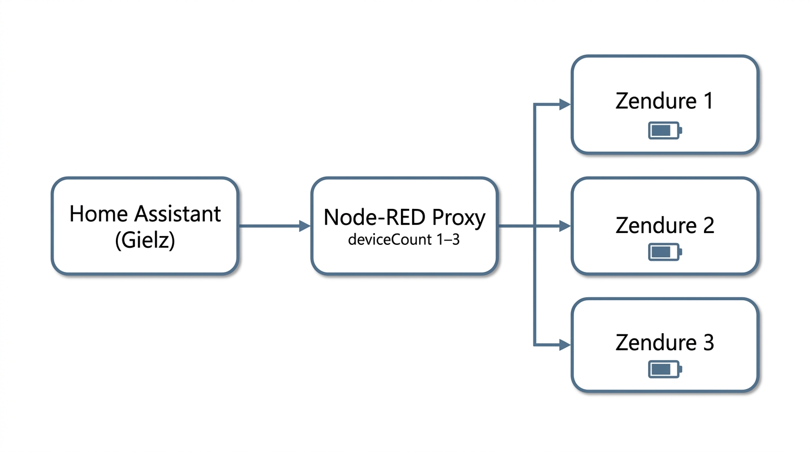
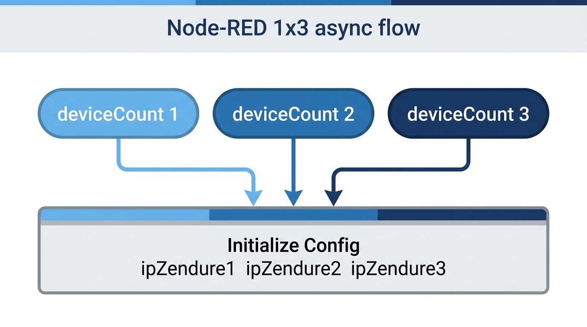
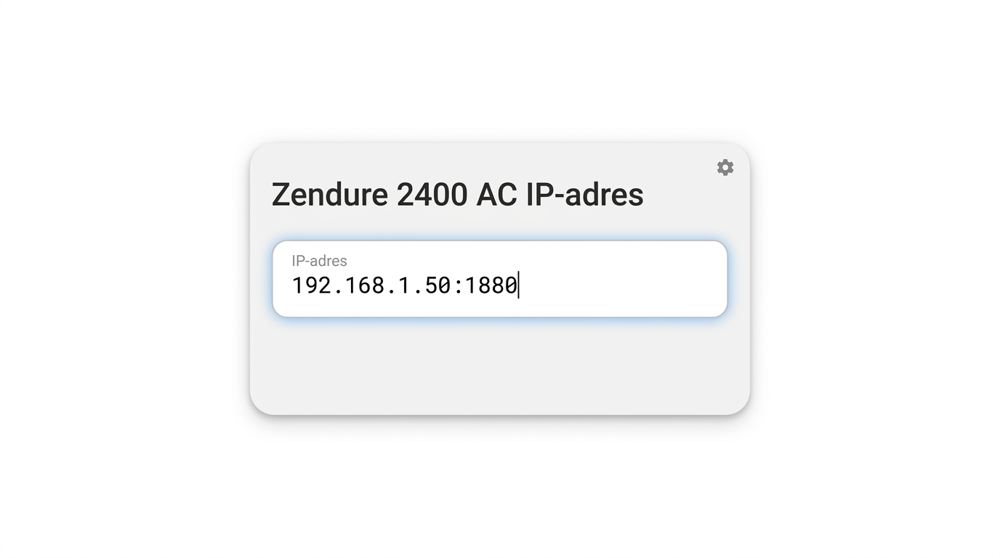
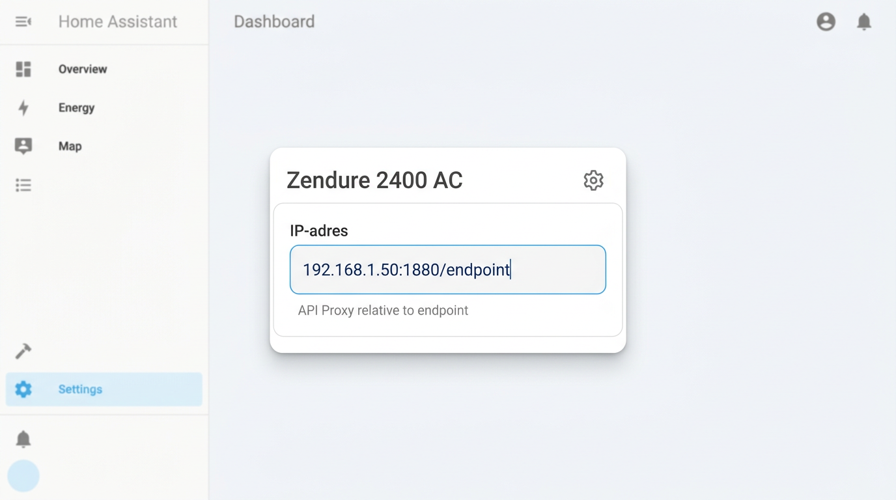
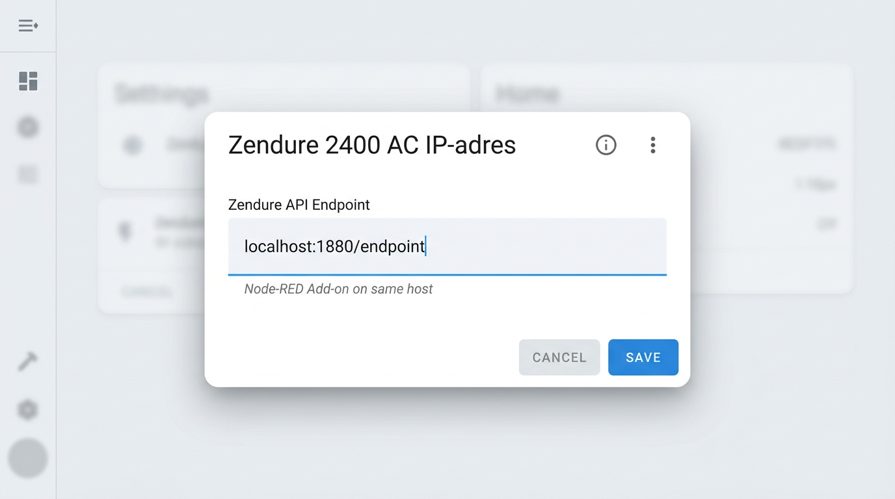
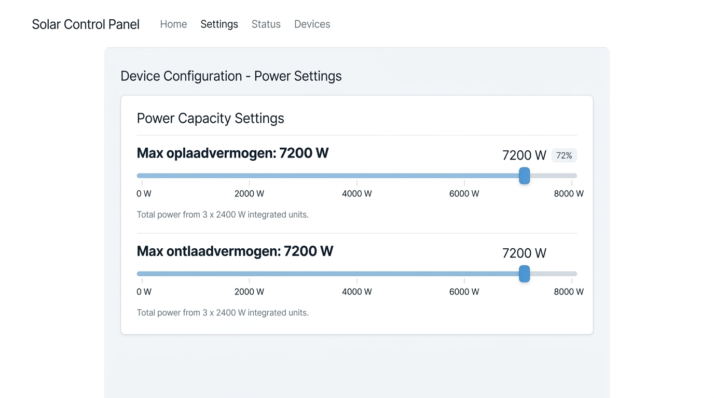
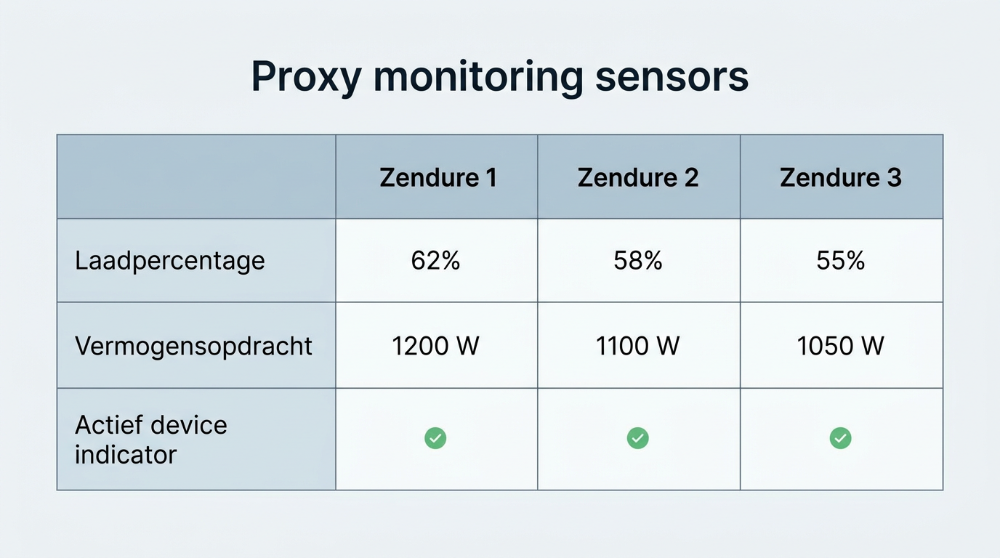
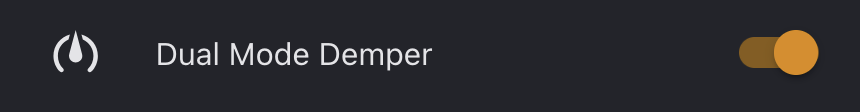
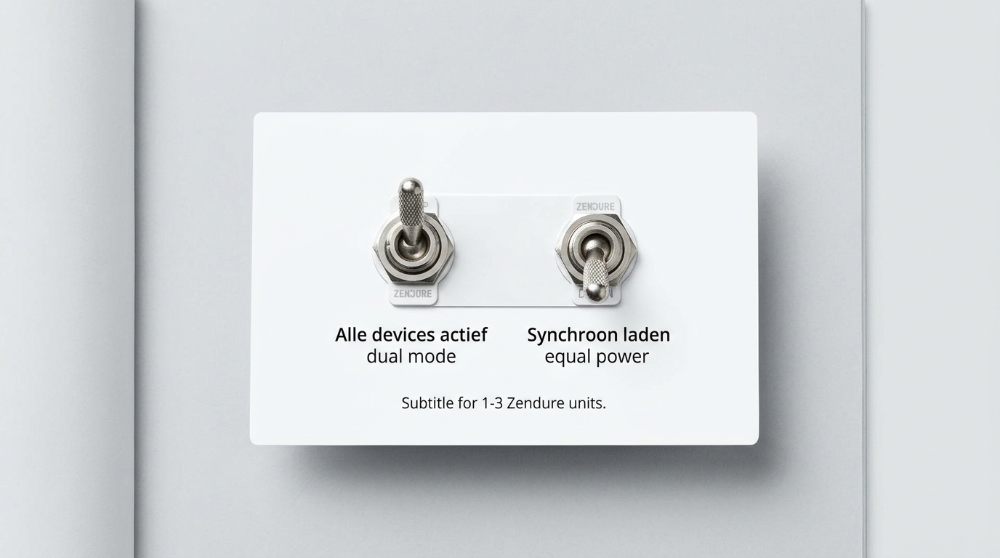

# Zendure-zenSDK-proxy

**Upstream:** [gast777/Zendure-zenSDK-proxy](https://github.com/gast777/Zendure-zenSDK-proxy). Deze fork ([hemertje/Zendure-zenSDK-proxy](https://github.com/hemertje/Zendure-zenSDK-proxy)) voegt een **async 1×3-flow** toe (`deviceCount` 1–3 in Node-RED) voor review; pull request richting upstream kan daarop geopend worden.

**Uitbreiding:** voor **1, 2 of 3** Zendure-omvormers met dezelfde Gielz-aanpak, zie [README-1x3.md](README-1x3.md) en importeer `Zendure-proxy-Node-Red-flow-1x3-async.json`.

De [Gielz-automatisering](https://github.com/Gielz1986/Zendure-HA-zenSDK) voor Zendure werkt goed om een Zendure thuisbatterij (die de ZenSDK API ondersteunt) lokaal te bedienen via Home Assistant. Hierdoor is de batterij niet meer afhankelijk van een verbinding met de cloud.

Een nadeel is dat de Gielz-automatisering normaal maar één Zendure-apparaat (omvormer) tegelijk ondersteunt.

Deze Node-RED flow lost dat op. Het werkt als een tussenstation (proxy server) waarmee je **één, twee of drie** Zendure-apparaten (bijv. [SolarFlow 2400AC](https://www.zendure.nl/products/zendure-solarflow-2400-ac)) kunt aansturen alsof het **één** apparaat is richting Home Assistant: één virtuele batterij met het **gecombineerde** vermogen (bijv. 2400 / 4800 / 7200 W bij gelijke units).

- **Klassieke flow** (`Zendure-proxy-Node-Red-flow.json`): bewezen gedrag voor **twee** Zendures (virtuele “4800”).
- **Uitgebreide flow** (`Zendure-proxy-Node-Red-flow-1x3-async.json`): **1–3** Zendures, `deviceCount` instelbaar in Node-RED — zie [README-1x3.md](README-1x3.md).

<br/>

   

<br/>
<br/>


Het werkt als volgt: Home Assistant (HA) praat met de **proxy**, niet rechtstreeks met elke Zendure. De proxy praat met **alle gekozen** fysieke Zendures (1, 2 of 3). Vanuit HA (Gielz) lijkt het nog steeds alsof er maar **één** Zendure-device is, met een maximaal vermogen dat overeenkomt met de som van je units (bijv. 3× 2400 W → 7200 W). De proxy verdeelt het vermogen dat HA aanstuurt over de actieve Zendures.

Het vermogen wordt verdeeld over de actieve units. Bij **meerdere** Zendures en verschil in SoC laadt de leegste sneller en ontlaadt de volste sneller, zodat percentages in de buurt blijven. Bij lagere vermogens kan (afhankelijk van de flow) slechts **één** unit tegelijk belast worden om efficiëntie.

Node-RED kan gemakkelijk als een Add-On geïnstalleerd worden in Home Assistant. Na importeren van de gekozen flow vul je de **IP-adressen** van je Zendure(s) in (en bij de 1×3-flow stel je eerst **deviceCount** in). Hieronder staat het schematisch; details per flow staan bij de importinstructies.

Vervolgens moet je een paar eenvoudige instellingen doen voor de Gielz automatisering in Home Assistant, zoals in onderstaande instructies te zien is. Daarna kan hij aan het werk :)<br/>
<br/>


## Instructies ##

### Node-RED ###
<br/>

- [ ] **Kies je flow:** importeer `Zendure-proxy-Node-Red-flow.json` (2 Zendures, klassiek) **of** `Zendure-proxy-Node-Red-flow-1x3-async.json` (1–3 Zendures) via Menu → Import.<br/>
- [ ] Vul de **IP-adressen** in in het configuratieblok (Initialize / “Vul hier de Zendure IP adressen in” bij de 2-device flow, of **ipZendure1 … ipZendure3** in de Initialize van de 1×3-flow). Klik **Deploy**.



*De klassieke 2-device flow heeft een eigen schermopname in de upstream-documentatie; bovenstaand concept geldt voor de **1×3 async**-tab. Bij de 2-device JSON zie je het rode kader rond het IP-blok zoals in de oorspronkelijke README.*

<br/>
<br/>

### Home Assistant ###
<br/>

<ins>_Deze instructie gaat ervan uit dat je minimaal de Maart 2026 versie van de [Gielz ZenSDK](https://github.com/Gielz1986/Zendure-HA-zenSDK) gebruikt. Mocht je een eerdere versie gebruiken, update de Gielz dan eerst._<ins>

<br/>

- [ ] Stap 1: Op een HA Dashboard heb je als het goed is reeds het invulveld "Zendure 2400 AC IP-adres" (`input_text.zendure_2400_ac_ip_adres`) beschikbaar, als onderdeel van de Gielz instructies. Zo niet, voeg die alsnog toe. Vul het IP adres en poort van de Node-RED proxy daar in. Bijvoorbeeld: 192.168.x.x:1880



Als in de blokken "API Proxy In" staat "The url will be relative to /endpoint", dan vul hier in IP_adres:poort/endpoint 

 

Als Node-RED op de Home Assistant server zelf is geinstalleerd als Add-On, vul in "localhost:1880/endpoint".




Na deze stap zouden de sensoren van Gielz in Home Assistant al moeten werken.

<br/>

- [ ] Stap 2: Op het dashboard, stel het maximale vermogen in via de invulvelden `input_number.zendure_2400_ac_max_ontlaadvermogen` en `input_number.zendure_2400_ac_max_oplaadvermogen`.

Stel het maximum passend bij je setup in: bijvoorbeeld **2400 W** (1× 2400), **4800 W** (2× 2400) of **7200 W** (3× 2400).




Hiermee is de installatie gereed. Je kunt hem nu in gebruik nemen door een aansturing te kiezen op het dashboard drop-down menu `input_select.zendure_2400_ac_modus_selecteren`. Kies bijvoorbeeld "Snel opladen" om te testen of dat werkt.
<br/>
<br/>


## Node-RED als Home Assistant Add-on ##

Indien Node-RED op de Home Assistant server zelf is geinstalleerd als Add-on, volg deze stappen om de flow direct te laten werken:<br/>

1) Home Assistant Add-On Configuratie van Node-RED:
- Zet "ssl" uit
- Zet "Show unused optional configuration options" aan
- Zet "leave_front_door_open" aan
- Save de configuratie
- Herstart Node-RED<br/>

2) Op het HA Dashboard, configureer als "Zendure 2400 AC IP-adres": <br />
localhost:1880/endpoint<br/>
<br/>


## Monitoring ##

Om real-time de status van de **fysieke Zendure(s)** achter de proxy te monitoren, stuurt de proxy naast de standaard-[REST API van Zendure](https://github.com/Zendure/zenSDK/blob/main/docs/en_properties.md)-attributen ook extra velden mee (per device o.a. `electricLevel_1…3`, vermogensopdrachten). Zo zie je hoe het totaal over de actieve units wordt verdeeld.

Voorbeeld van **per-unit** proxy-monitoring (1–3 Zendures): overzicht van laadpercentage en vermogens per unit.




Om deze in Home Assistant beschikbaar te maken, voegen we de extra sensoren toe aan de configuration.yaml of aan de package die [Gielz](https://github.com/Gielz1986/Zendure-HA-zenSDK) beschikbaar stelt. 

### Instructie ###

In de configuration.yaml of de package van Gielz (zendure_ha_zensdk_gielz1986.yaml) staan de volgende regels om aan de geven waar de Proxy sensoren ingevoegd kunnen worden:
```
####### BEGIN - Plaats hier je Node-RED sensoren tussen van https://github.com/gast777/Zendure-zenSDK-proxy - BEGIN #######


####### EIND - Plaats hier je Node-RED sensoren tussen van https://github.com/gast777/Zendure-zenSDK-proxy - EIND ####### 
```
Kopieer en plak de volgende sensoren tussen de aangegeven regels:
```
####### ZENDURE PROXY SENSOREN #######

      - name: "Zendure 1 Laadpercentage"
        value_template: "{{ value_json['properties']['electricLevel_1'] }}"
        device_class: battery
        unit_of_measurement: "%"
        state_class: measurement
        unique_id: Zendure_proxy_Laadpercentage_1

      - name: "Zendure 2 Laadpercentage"
        value_template: "{{ value_json['properties']['electricLevel_2'] }}"
        device_class: battery
        unit_of_measurement: "%"
        state_class: measurement
        unique_id: Zendure_proxy_Laadpercentage_2

      - name: "Zendure 3 Laadpercentage"
        value_template: "{{ value_json['properties']['electricLevel_3'] }}"
        device_class: battery
        unit_of_measurement: "%"
        state_class: measurement
        unique_id: Zendure_proxy_Laadpercentage_3

      - name: "Vermogensopdracht"
        value_template: "{{ value_json['properties']['latestPowerCmd'] | int }}"
        unique_id: Zendure_proxy_latest_power_command
        unit_of_measurement: "W"
        state_class: measurement
        device_class: power

      - name: "Vermogensopdracht Zendure 1"
        value_template: "{{ value_json['properties']['latestPowerCmd_1'] | int }}"
        unique_id: Zendure_proxy_latest_power_command_1
        unit_of_measurement: "W"
        state_class: measurement
        device_class: power

      - name: "Vermogensopdracht Zendure 2"
        value_template: "{{ value_json['properties']['latestPowerCmd_2'] | int }}"
        unique_id: Zendure_proxy_latest_power_command_2
        unit_of_measurement: "W"
        state_class: measurement
        device_class: power

      - name: "Vermogensopdracht Zendure 3"
        value_template: "{{ value_json['properties']['latestPowerCmd_3'] | int }}"
        unique_id: Zendure_proxy_latest_power_command_3
        unit_of_measurement: "W"
        state_class: measurement
        device_class: power

      - name: "Zendure 1 Vermogen Aansturing"
        value_template: >
          
          
          
            {{ opladen }}
          
            {{ ontladen }}
          
        unique_id: Zendure_proxy_Vermogen_Aansturing_1
        unit_of_measurement: "W"
        state_class: measurement
        device_class: power

      - name: "Zendure 2 Vermogen Aansturing"
        value_template: >
          
          
          
            {{ opladen }}
          
            {{ ontladen }}
          
        unique_id: Zendure_proxy_Vermogen_Aansturing_2
        unit_of_measurement: "W"
        state_class: measurement
        device_class: power

      - name: "Zendure 3 Vermogen Aansturing"
        value_template: >
          
          
          
            {{ opladen }}
          
            {{ ontladen }}
          
        unique_id: Zendure_proxy_Vermogen_Aansturing_3
        unit_of_measurement: "W"
        state_class: measurement
        device_class: power

      - name: "Zendure 1 Kalibratie bezig"
        value_template: >
          
          
          {{ states.get(packState, "Onbekend") }}
        unique_id: Zendure_proxy_SOC_Status_1
        icon: mdi:battery-heart-variant

      - name: "Zendure 2 Kalibratie bezig"
        value_template: >
          
          
          {{ states.get(packState, "Onbekend") }}
        unique_id: Zendure_proxy_SOC_Status_2
        icon: mdi:battery-heart-variant

      - name: "Zendure 3 Kalibratie bezig"
        value_template: >
          
          
          {{ states.get(packState, "Onbekend") }}
        unique_id: Zendure_proxy_SOC_Status_3
        icon: mdi:battery-heart-variant

      - name: "Zendure 1 Opslagmodus"
        value_template: >
          
          
          {{ states.get(packState, "Onbekend") }}
        unique_id: Zendure_proxy_Opslagmodus_1
        icon: mdi:floppy

      - name: "Zendure 2 Opslagmodus"
        value_template: >
          
          
          {{ states.get(packState, "Onbekend") }}
        unique_id: Zendure_proxy_Opslagmodus_2
        icon: mdi:floppy

      - name: "Zendure 3 Opslagmodus"
        value_template: >
          
          
          {{ states.get(packState, "Onbekend") }}
        unique_id: Zendure_proxy_Opslagmodus_3
        icon: mdi:floppy

      - name: "Zendure Actief Device"
        value_template: >
          
          
           Geen
          
           Alle (dual/multi)
          
           Zendure {{ active_device }}
          
        unique_id: Zendure_proxy_active_device
        icon: mdi:battery

      - name: "Zendure 1 SOC-limiet Status"
        value_template: >
          
          
          {{ states.get(packState, "Onbekend") }}
        unique_id: Zendure_proxy_soc_limiet_status_1
        icon: >
         
          mdi:battery-medium
         
          mdi:battery-high
         
          mdi:battery-low
         
          mdi:battery-outline
         

      - name: "Zendure 2 SOC-limiet Status"
        value_template: >
          
          
          {{ states.get(packState, "Onbekend") }}
        unique_id: Zendure_proxy_soc_limiet_status_2
        icon: >
         
          mdi:battery-medium
         
          mdi:battery-high
         
          mdi:battery-low
         
          mdi:battery-outline
         

      - name: "Zendure 3 SOC-limiet Status"
        value_template: >
          
          
          {{ states.get(packState, "Onbekend") }}
        unique_id: Zendure_proxy_soc_limiet_status_3
        icon: >
         
          mdi:battery-medium
         
          mdi:battery-high
         
          mdi:battery-low
         
          mdi:battery-outline
         

      - name: "Dual Mode Demper Status"
        unique_id: Zendure_proxy_dualModeDamper
        value_template: >
          
          
            Aan
          
            Uit
          
            Onbekend
          
        icon: mdi:speedometer-medium

      - name: "Synchroon Laden Status"
        unique_id: Zendure_proxy_equalMode
        value_template: >
          
          
            Aan
          
            Uit
          
            Onbekend
          
        icon: >
          
            mdi:battery-sync
          
            mdi:battery-sync-outline
          

      - name: "Beide Actief Status"
        unique_id: Zendure_proxy_alwaysDualMode
        value_template: >
          
          
            Aan
          
            Uit
          
            Onbekend
          
        icon: mdi:format-columns

      - name: "Zendure 1 Omvormer Temperatuur"
        value_template: >
          
          {{ (maxTemp - 2731) / 10.0 }}
        unique_id: Zendure_proxy_Omvormer_Temperatuur_1
        unit_of_measurement: "°C"
        state_class: measurement
        device_class: temperature
        icon: mdi:thermometer

      - name: "Zendure 2 Omvormer Temperatuur"
        value_template: >
          
          {{ (maxTemp - 2731) / 10.0 }}
        unique_id: Zendure_proxy_Omvormer_Temperatuur_2
        unit_of_measurement: "°C"
        state_class: measurement
        device_class: temperature
        icon: mdi:thermometer

      - name: "Zendure 3 Omvormer Temperatuur"
        value_template: >
          
          {{ (maxTemp - 2731) / 10.0 }}
        unique_id: Zendure_proxy_Omvormer_Temperatuur_3
        unit_of_measurement: "°C"
        state_class: measurement
        device_class: temperature
        icon: mdi:thermometer

      - name: "Zendure 1 Serienummer"
        unique_id: Zendure_proxy_Serienummer_1
        value_template: "{{ value_json.sn_1 }}"
        icon: mdi:identifier

      - name: "Zendure 2 Serienummer"
        unique_id: Zendure_proxy_Serienummer_2
        value_template: "{{ value_json.sn_2 }}"
        icon: mdi:identifier

      - name: "Zendure 3 Serienummer"
        unique_id: Zendure_proxy_Serienummer_3
        value_template: "{{ value_json.sn_3 }}"
        icon: mdi:identifier

      - name: "Zendure Proxy Versie"
        value_template: "{{ value_json.proxyVersion }}"
        unique_id: Zendure_Proxy_Versie
        icon: mdi:call-split

####### EINDE ZENDURE PROXY SENSOREN ####### 
```

Na herstart van Home Assistant kunnen deze entiteiten vervolgens aan het dashboard worden toegevoegd en gemonitord.

Om deze sensoren direct in een dasboard te krijgen, kun je een kaart toevoegen en de volgende code erin plakken:

```
type: entities
entities:
  - entity: sensor.vermogensopdracht
  - entity: sensor.vermogensopdracht_zendure_1
  - entity: sensor.vermogensopdracht_zendure_2
  - entity: sensor.vermogensopdracht_zendure_3
  - entity: sensor.zendure_1_vermogen_aansturing
  - entity: sensor.zendure_2_vermogen_aansturing
  - entity: sensor.zendure_3_vermogen_aansturing
  - entity: sensor.zendure_actief_device
  - entity: sensor.zendure_1_laadpercentage
  - entity: sensor.zendure_2_laadpercentage
  - entity: sensor.zendure_3_laadpercentage
  - entity: sensor.zendure_1_soc_limiet_status
  - entity: sensor.zendure_2_soc_limiet_status
  - entity: sensor.zendure_3_soc_limiet_status
  - entity: sensor.zendure_1_opslagmodus
  - entity: sensor.zendure_2_opslagmodus
  - entity: sensor.zendure_3_opslagmodus
  - entity: sensor.zendure_1_kalibratie_bezig
  - entity: sensor.zendure_2_kalibratie_bezig
  - entity: sensor.zendure_3_kalibratie_bezig
  - entity: sensor.zendure_1_omvormer_temperatuur
  - entity: sensor.zendure_2_omvormer_temperatuur
  - entity: sensor.zendure_3_omvormer_temperatuur
  - entity: sensor.dual_mode_demper_status
  - entity: sensor.zendure_1_serienummer
  - entity: sensor.zendure_2_serienummer
  - entity: sensor.zendure_3_serienummer
  - entity: sensor.zendure_proxy_versie
title: Zendure Proxy Sensoren
```

Nu kan het feest beginnen!

<br/>
<br/>

### Proxy attributen specificatie ###

Per-unit velden `_*_1` … `_*_3` zijn aanwezig zodra de proxy die units kent (`deviceCount` 1–3 in de 1×3-flow, of vaste 2 in de klassieke JSON).

<br/>

 | Attribuut | Beschrijving |
 |-----------|-------------|
 | `properties.electricLevel_1` | Laadpercentage van de Zendure 1 |
 | `properties.electricLevel_2` | Laadpercentage van de Zendure 2 |
 | `properties.electricLevel_3` | Laadpercentage van de Zendure 3 (aanwezig als `deviceCount` ≥ 3) |
 | `properties.latestPowerCmd` | Het vermogen van de meest recente opdracht aan de proxy om te laden of ontladen |
 | `properties.latestPowerCmd_1` | Het vermogen van de meest recente opdracht aan de Zendure 1 om te laden of ontladen |
 | `properties.latestPowerCmd_2` | Het vermogen van de meest recente opdracht aan de Zendure 2 om te laden of ontladen |
 | `properties.latestPowerCmd_3` | Idem voor Zendure 3 (indien van toepassing) |
 | `properties.outputHomePower_1` | Vermogen uitgaand naar het net (ontladen) van Zendure 1 |
 | `properties.outputHomePower_2` | Idem Zendure 2 |
 | `properties.outputHomePower_3` | Idem Zendure 3 |
 | `properties.gridInputPower_1` | Vermogen inkomend van het net (laden) van Zendure 1 |
 | `properties.gridInputPower_2` | Idem Zendure 2 |
 | `properties.gridInputPower_3` | Idem Zendure 3 |
 | `properties.packInputPower_1` | Vermogen komend vanuit de batterijen (ontladen) van Zendure 1 |
 | `properties.packInputPower_2` | Idem Zendure 2 |
 | `properties.packInputPower_3` | Idem Zendure 3 |
 | `properties.outputPackPower_1` | Vermogen uitgaand naar de batterijen (laden) van Zendure 1 |
 | `properties.outputPackPower_2` | Idem Zendure 2 |
 | `properties.outputPackPower_3` | Idem Zendure 3 |
 | `properties.socStatus_1` | Indicatie of het Zendure 1 device geforceerd aan het opladen is vanwege kalibratie.<br/>Waarden: 0: Nee, 1: Kalibreren |
 | `properties.socStatus_2` | Idem Zendure 2 |
 | `properties.socStatus_3` | Idem Zendure 3 |
 | `properties.smartMode_1` | smartMode status van Zendure 1.<br/>Waarden: 0: Smartmode uit (schrijven naar Flash), 1: Smartmode aan (schrijven naar RAM) |
 | `properties.smartMode_2` | Idem Zendure 2 |
 | `properties.smartMode_3` | Idem Zendure 3 |
 | `properties.activeDevice` | Actief device.<br/>Waarden: 0: alle gekoppelde units in dual/multi-mode, 1: Zendure 1, 2: Zendure 2, 3: Zendure 3 (indien van toepassing), -1: geen |
 | `properties.dualModeDamper` | Dual Mode Demper.<br/>Waarden: 0: Uit, 1: Aan (read/write) |
 | `properties.alwaysDualMode` | “Alle actief” (dual/multi). Altijd alle gekoppelde units in dual mode; single mode uit.<br/>Waarden: 0: Uit, 1: Aan (read/write) |
 | `properties.equalMode` | Synchroon laden: dual mode met gelijk vermogen op alle actieve units.<br/>Waarden: 0: Uit, 1: Aan (read/write) |
 | `properties.socLimit_1` | SOC-limiet Status van het Zendure 1 device.<br/>Waarden: 0: Normale werking, 1: Oplaadlimiet bereikt, 2: Ontlaadlimiet bereikt |
 | `properties.socLimit_2` | Idem Zendure 2 |
 | `properties.socLimit_3` | Idem Zendure 3 |
 | `properties.hyperTmp_1` | Omvormertemperatuur van het Zendure 1 device. |
 | `properties.hyperTmp_2` | Idem Zendure 2 |
 | `properties.hyperTmp_3` | Idem Zendure 3 |
 | `sn_1` | Serienummer van de omvormer van het Zendure 1 device. |
 | `sn_2` | Idem Zendure 2 |
 | `sn_3` | Idem Zendure 3 |
 | `proxyVersion` | Versie van de Proxy. |
<br/>
<br/>

### Optioneel: Nog meer per device monitoren? ###

<details>
<summary>Open deze sectie.</summary>

<br/>

Het is onwaarschijnlijk, maar zou je nog meer details per device willen monitoren, die niet per device door de proxy worden doorgegeven en die minder real-time hoeven te zijn? Dan kun je eenvoudig een minder frequente REST polling toevoegen in je configuration.yaml (of in een aparte package, niet in de Gielz package). Deze verbindt rechtstreeks naar de Zendure devices IP adressen, dus niet via de proxy.<br/>

<br/>
Voorbeeld:
<br/>

```
rest:

  - resource: http://192.168.x.x/properties/report
    scan_interval: 120
    sensor:

      - name: "Zendure 1 Signaalsterkte"
        value_template: >
          
          
            Uitstekend
          
            Goed
          
            Zwak
          
            Slecht
          
        unique_id: Zendure_1_Signaalsterkte
        icon: mdi:wifi

      - name: "Zendure 1 Error"
        value_template: >
          
          
          {{ states.get(packState, "Onbekend") }}
        unique_id: Zendure_1_Error
        icon: mdi:battery-alert


  - resource: http://192.168.x.y/properties/report
    scan_interval: 120
    sensor:

      - name: "Zendure 2 Signaalsterkte"
        value_template: >
          
          
            Uitstekend
          
            Goed
          
            Zwak
          
            Slecht
          
        unique_id: Zendure_2_Signaalsterkte
        icon: mdi:wifi

      - name: "Zendure 2 Error"
        value_template: >
          
          
          {{ states.get(packState, "Onbekend") }}
        unique_id: Zendure_2_Error
        icon: mdi:battery-alert

  - resource: http://192.168.x.z/properties/report
    scan_interval: 120
    sensor:

      - name: "Zendure 3 Signaalsterkte"
        value_template: >
          
          
            Uitstekend
          
            Goed
          
            Zwak
          
            Slecht
          
        unique_id: Zendure_3_Signaalsterkte
        icon: mdi:wifi

      - name: "Zendure 3 Error"
        value_template: >
          
          
          {{ states.get(packState, "Onbekend") }}
        unique_id: Zendure_3_Error
        icon: mdi:battery-alert
        
```
NB: voeg geen hoog frequente polling toe, om de Zendure devices niet te overbelasten met te veel verzoeken.
<br/>
<br/>
NB: van de attributen in bovenstaand voorbeeld wordt reeds de laagste (slechtste) waarde van de **gekozen** devices door de proxy doorgegeven in het reguliere attribuut (rssi / is_error) van het virtuele device. Dus als er een probleem is, zul je dat ook zonder deze extra configuratie kunnen zien.


<br/>
<br/>

**Tip**: om te zien welke attributen er beschikbaar zijn om te monitoren, kun je in Node-RED de debug node (groen blokje) even aanzetten die verbonden is met het blok "Join Responses" of "Call Zendure 1 API". Vervolgens verschijnen de messages rechts in het debug venster (de tab met het kevertje). Deze messages kun je uitvouwen om te zien welke informatie erin meegestuurd wordt.
<br/>
<br/>
</details>

<br/>

### Optioneel: Dual Mode Demper ###

<details>
<summary>Open deze sectie.</summary>

<br/>


De Dual Mode Demper voorkomt dat dual/multi mode direct inschakelt bij een kortstondige piek tijdens het ontladen (typisch **klassieke 2-device** flow). Bijvoorbeeld een korte piek van een keukenboiler. Zo wordt een slapend device niet onnodig wakker (smartMode = 0) voor een korte piek. *(In de 1×3 async-flow zit deze logica niet standaard in dezelfde tab — zie [README-1x3.md](README-1x3.md).)*

De status (Aan/Uit) van de Dual Mode Demper kan uitgelezen worden via de sensor __sensor.dual_mode_demper_status__.

De maximale tijd en hoogte van de demping kan alleen ingesteld worden in de Node-RED flow in het blokje "Vul hier de Zendure IP adressen in". Standaard werkt deze functie maximaal 60 seconden per piek en bij een maximale overschrijding van 150 Watt. Bij een langduriger of hogere vermogenspiek zal wel gewoon naar dual mode overgeschakeld worden.

Standaardinstellingen, aan te passen in het blokje "Vul hier de Zendure IP adressen in": <br/>
<br/>
```
let dualmode_damper_enable = 0      // Dual-mode Demper staat standaard uit
let dualmode_damper_timer = 60      // seconden
let dualmode_damper_amount = 150    // Watt
```

De Dual-mode Demper werkt alleen tijdens ontladen, niet tijdens laden.

Deze demper kan op verschillende manieren in en uitgeschakeld worden:

<br/>

#### ==> Via een toggle switch op het dashboard ####

<br/>



<br/>
<br/>
Hoe te installeren:

1) De REST sensoren van [Monitoring](#monitoring) moeten geinstalleerd zijn in de Gielz package of in de configuration.yaml. Het handigst is om de Gielz Package te gebruiken. Zie de [instructie van Gielz](https://github.com/Gielz1986/Zendure-HA-zenSDK/tree/main?tab=readme-ov-file#%EF%B8%8F%E2%83%A3-configuratie-en-herstart) hoe die te installeren.
2) Voeg de volgende items toe aan configuration.yaml of een aparte package (niet aan de Gielz package).

```
template:

  - switch:

      - name: "Dual Mode Demper"
        unique_id: Zendure_proxy_dualModeDamper_switch
        state: >
          {{ is_state('sensor.dual_mode_demper_status', 'Aan') }}
        icon: mdi:speedometer-medium
        turn_on:
          - service: rest_command.set_dualmodedamper_on
        turn_off:
          - service: rest_command.set_dualmodedamper_off


rest_command:

  set_dualmodedamper_on:
    url: http://{{ states('input_text.zendure_2400_ac_ip_adres') }}/properties/write
    method: POST
    content_type: "application/json"
    payload: >
      {
        "properties": {
          "dualModeDamper": {{ 1 }}
        }
      }

  set_dualmodedamper_off:
    url: http://{{ states('input_text.zendure_2400_ac_ip_adres') }}/properties/write
    method: POST
    content_type: "application/json"
    payload: >
      {
        "properties": {
          "dualModeDamper": {{ 0 }}
        }
      }
```

3) Herstart Home Assistant
4) Zet de toggle switch `switch.dual_mode_demper` op je dashboard.


<br/>

#### ==> Via een automation die de Dual Mode Demper altijd aan houdt ####

Als je de Dual Mode Demper altijd aan wilt laten staan, ook na her-instalatie van de Proxy Node-RED flow en na restart van Node-RED, dan kun je deze automation gebruiken samen met een rest command.

1) Voeg dit rest command toe aan configuration.yaml of een aparte package (niet aan de Gielz package).

```
rest_command:

  set_dualmodedamper_on:
    url: http://{{ states('input_text.zendure_2400_ac_ip_adres') }}/properties/write
    method: POST
    content_type: "application/json"
    payload: >
      {
        "properties": {
          "dualModeDamper": {{ 1 }}
        }
      }
```

2) Voeg de volgende automation toe (Settings -> Automations & Scenes, Create New Automation, Edit in Yaml)

```
alias: Zendure Proxy - Dual Mode Demper altijd aan
description: ""
triggers:
  - trigger: state
    entity_id:
      - sensor.dual_mode_demper_status
    to:
      - Uit
conditions: []
actions:
  - action: rest_command.set_dualmodedamper_on
    data: {}
mode: single
```

<br/>

#### ==> In de Node-RED flow in het blokje "Vul hier de Zendure IP adressen in" ####

Verander ```let dualmode_damper_enable = 0``` naar ```let dualmode_damper_enable = 1```

Dit moet dan wel weer opnieuw ingesteld worden na upgrade van de Proxy flow in Node-RED.


</details>

<br/>

### Optioneel: Alle actief (dual/multi) en Synchroon laden ###

<details>
<summary>Open deze sectie.</summary>

<br/>

Met de instelling **alwaysDualMode** (_in HA vaak nog “Beide Actief” genoemd_) blijven **alle** gekoppelde Zendures actief — dus dual/multi mode, geen single mode.  
**Synchroon laden** (`equalMode`) is dezelfde basis, maar dan met **gelijk vermogen** op alle actieve units.

Deze features zijn zeldzaam nodig; ze zijn vooral relevant bij **twee** units in de klassieke flow. Met drie units: alleen gebruiken als je het gedrag echt nodig hebt (en test goed).

Beide schakelaars bedien je via toggles op het dashboard (namen in YAML hieronder: “Beide Actief” / “Synchroon Laden” — entity-id’s blijven compatibel met bestaande dashboards).
<br/>
<br/>



<br/>
<br/>
Hoe te installeren:

1) De REST sensoren van [Monitoring](#monitoring) moeten geinstalleerd zijn in de Gielz package of in de configuration.yaml. Het handigst is om de Gielz Package te gebruiken. Zie de [instructie van Gielz](https://github.com/Gielz1986/Zendure-HA-zenSDK/tree/main?tab=readme-ov-file#%EF%B8%8F%E2%83%A3-configuratie-en-herstart) hoe die te installeren.
2) Voeg de volgende items toe aan configuration.yaml (niet aan de Gielz package, kan wel in een aparte package).

```

template:

  - switch:

      - name: "Beide Actief"
        unique_id: Zendure_proxy_alwaysDualMode_switch
        state: >
          {{ is_state('sensor.beide_actief_status', 'Aan') }}
        icon: mdi:format-columns
        turn_on:
          - service: rest_command.set_alwaysdualmode_on
        turn_off:
          - service: rest_command.set_alwaysdualmode_off

      - name: "Synchroon Laden"
        unique_id: Zendure_proxy_equalMode_switch
        state: >
          {{ is_state('sensor.synchroon_laden_status', 'Aan') }}
        icon: >
          
            mdi:battery-sync
          
            mdi:battery-sync-outline
          
        turn_on:
          - service: rest_command.set_equalmode_on
        turn_off:
          - service: rest_command.set_equalmode_off


rest_command:

  set_alwaysdualmode_on:
    url: http://{{ states('input_text.zendure_2400_ac_ip_adres') }}/properties/write
    method: POST
    content_type: "application/json"
    payload: >
      {
        "properties": {
          "alwaysDualMode": {{ 1 }}
        }
      }

  set_alwaysdualmode_off:
    url: http://{{ states('input_text.zendure_2400_ac_ip_adres') }}/properties/write
    method: POST
    content_type: "application/json"
    payload: >
      {
        "properties": {
          "alwaysDualMode": {{ 0 }}
        }
      }

  set_equalmode_on:
    url: http://{{ states('input_text.zendure_2400_ac_ip_adres') }}/properties/write
    method: POST
    content_type: "application/json"
    payload: >
      {
        "properties": {
          "equalMode": {{ 1 }}
        }
      }

  set_equalmode_off:
    url: http://{{ states('input_text.zendure_2400_ac_ip_adres') }}/properties/write
    method: POST
    content_type: "application/json"
    payload: >
      {
        "properties": {
          "equalMode": {{ 0 }}
        }
      }
```

3) Herstart Home Assistant
4) Zet de toggle switches `switch.beide_actief` en `switch.synchroon_laden` op je dashboard.

Als je **Beide Actief** aan zet, blijven alle gekoppelde Zendures in dual/multi mode actief. Met **Synchroon Laden** aan laden/ontladen alle actieve units met hetzelfde vermogen.

</details>


<br/>
<br/>


## Features ##
*Hieronder: gedrag van de **klassieke 2-device** flow (`Zendure-proxy-Node-Red-flow.json`). De **1×3 async**-flow volgt dezelfde ideeën voor GET/POST maar heeft een vereenvoudigde vermogensverdeling (zie [README-1x3.md](README-1x3.md)).*

- SoC-balancering — bij **meerdere** gekoppelde Zendures blijft de SoC (laadpercentage) in de buurt: de volste batterij ontlaadt sneller, de leegste laadt sneller. Bij gelijke SoC laden ze even snel.
- Herhaling van instructies om te laden/ontladen, zodat SoC-balancering tussen de Zendures ook werkt voor handmatige modus.
- Single mode — bij lagere vermogens laadt/ontlaadt vaak één Zendure tegelijk; de actieve unit wisselt o.b.v. SoC zodat de waarden in balans blijven.
- In single mode wordt het passieve device (dat geen vermogen levert) na 5 minuten op standby gezet (smartMode = 0, “Opslaan in Flash”).
- In single mode wordt naar een andere unit overgeschakeld wanneer het SoC-verschil ~5% is (minder ping-pong).
- Bij overschakeling tussen units of van single naar dual mode kunnen tijdens de overgang **twee** units tegelijk actief zijn; het reeds actieve device krijgt eerst ~95% van het vermogen zodat de andere kan opstarten.
<br/>

## Vereisten ## 
- **Compatibele Zendure-units**, bijv. SolarFlow 2400 AC (ook SolarFlow 800 Plus/Pro, 1600 AC+, 2400 AC+/Pro zijn genoemd als compatibel; combinaties nog niet overal getest). Je kunt **1, 2 of 3** units via de proxy koppelen (klassieke JSON = 2; **1×3** = `deviceCount` in Node-RED; zie [README-1x3.md](README-1x3.md)). Kies voor een zo gelijk mogelijke capaciteit en max. vermogen per unit.
- Zelfde **min/max laadpercentage** (SoC) op alle actieve Zendures.
- Zelfde **batterijcapaciteit** of vergelijkbaar kWh-gedrag per unit waar mogelijk.
- **Vaste IP-adressen** voor alle betrokken Zendures en voor de Node-RED-host (of HA).
- Goede **WiFi**.
- Alle gekozen units **online** en werkend.
<br/>

## Beperkingen ##
- Zonnepanelen direct via DC aangesloten op de Zendures zijn niet ondersteund/getest. Het zou wel kunnen werken, maar is nog niet getest.
- Bij een instructie van 0 Watt laden levert een Zendure device soms rond de 20 Watt. Dit is momenteel Zendure gedrag en geen probleem. Dit wordt op 0 gezet zodra het passieve device automatisch op standby gezet wordt (smartMode = 0, "Opslaan in Flash").
- Met Node-RED 4.0.9 zijn er door een gebruiker problemen gerapporteerd, die met versie 4.1.2 niet meer optraden (thanks [Freemann](https://tweakers.net/gallery/45846/)). Node-RED versie 4.1.1 en 4.1.4 zijn ook getest en werken prima.
<br/>


## Versie ##

Huidige versie: 20260308
<br/>

# Release-notes #

*Onderstaande punten zijn geschreven voor de **klassieke 2-device** proxy; ze blijven relevant als historisch changelog. Voor **1×3** zie [README-1x3.md](README-1x3.md).*

## Nieuw in versie 20260201 ##

- De product string die via de GET requests wordt doorgegeven aan Home Assistant (in properties.product) zal nu in plaats van "PROXY-NODE-RED" de daadwerkelijke product string van de Zendure devices zijn, zoals "solarFlow2400AC". Deze verandering is nodig omdat vanaf de Gielz Maart 2026 versie deze string gebruikt zal worden om de capaciteit van de batterijen te bepalen.
- Het maximale vermogen dat aan de devices gevraagd zal worden, wordt nu automatisch aangepast aan het ingestelde Max. Oplaadvermogen en Max. Ontlaadvermogen. Dit kan nu afwijken van 4800 Watt. Als bijvoorbeeld 3600 Watt als Max. Oplaadvermogen wordt ingesteld, zal op beide Zendure devices 1800 Watt (ieder de helft) ingesteld worden. Ook zal de proxy dan maximaal 1800 Watt aan ieder device vragen te laden en daarmee rekening houden bij het verdelen van het vermogen.
- Het Max. Oplaadvermogen en Max. Ontlaadvermogen kunnen nu verschillend zijn en de proxy zal daar rekening mee houden.
- Als het Max. Oplaadvermogen en Max. Ontlaadvermogen verschillend zijn, zal ook het absolute vermogen afgeleid van de singleMode_upperlimit_percent en singleMode_lowerlimit_percent verschillend zijn. De limieten zijn standaard respectievelijk 100% en 40% van het max vermogen voor opladen of ontladen. De absolute waarden zullen nu dus per richting kunnen verschillen met het max vermogen. Deze bepalen wanneer er wordt omgeschakeld tussen 1 of 2 devices tegelijk gebruiken om te laden/ontladen.
- Als het het Max. Oplaadvermogen of Max. Ontlaadvermogen op de beide Zendure devices niet hetzelfde is ingesteld, zal er nu een waarschuwing gelogd worden in Node-RED.

## Nieuw in versie 20260206 ##

- In Node-RED wordt nu een duidelijke waarschuwing in het debug venster gegeven als de twee Zendure devices niet hetzelfde ingesteld zijn wat betreft Minimale/Maximale Laadpercentage (SoC%) of Minimale/Maximale Oplaadvermogen/Ontlaadvermogen. Om onnodige meldingen te voorkomen op het moment van aanpassen van deze instellingen, verschijnen deze logs niet direct, maar pas als de error situatie een tijdje aanwezig is.
- Kleine optimalisaties in gedrag.

## Nieuw in versie 20260209 ##
- Vanaf nu worden de omvormertemperatuur en de serienummers van de gekoppelde Zendures standaard meegestuurd via de REST API en zijn dus beschikbaar in Home Assistant. Ook zijn de sensoren daarvoor toegevoegd aan de lijst onder [Monitoring](#monitoring).

## Nieuw in versie 20260211 ##
- Enkele checks toegevoegd om nuttige foutmeldingen te kunnen geven wanneer nodig.
- Instructies blok up-to-date gebracht en vereenvoudigd.

## Nieuw in versie 20260212 ##
- _Actief Device_ toont nu _Geen_ wanneer de huidige vermogensopdracht nul is. Om dit correct te tonen in Home Assistant is ook de REST sensor "Zendure Actief Device" aangepast. De nieuwe benodigde REST sensor configuratie is hierboven te zien onder [Monitoring](#monitoring).

## Nieuw in versie 20260213 ##
- Vanaf deze versie hoeven de serienummers niet meer te worden ingevuld bij installatie van de Node-RED flow. Alleen de beide IP adressen moeten ingevuld worden. Node-RED zal nu zelf de serienummers van de twee Zendures uitlezen en gebruiken.

## Nieuw in versie 20260215 ##
- "Zendure 1 Vermogen Aansturing" en "Zendure 2 Vermogen Aansturing" zijn nu toegevoegd aan de sensoren voor Home Assistant, zie [Monitoring](#monitoring).
- De outputPackPower en packInputPower wordt nu voor beide Zendures meegestuurd door de proxy.

## Nieuw in versie 20260217 ##
- Ondersteuning toegevoegd voor "Synchroon Laden". Daarmee kan indien gewenst geforceerd worden dat beide Zendure devices steeds met hetzelfde vermogen laden.

## Nieuw in versie 20260219 ##
- Issue opgelost waarbij de overgang van single mode naar dual mode niet vloeiend verliep
- Kleine verbeteringen

## Nieuw in versie 20260220 ##
- Vanaf deze versie worden de Zendure attributen _outputHomePower_ en _gridInputPower_ doorgegeven.
- Ondersteuning toegevoegd voor "Beide Actief". Daarmee kan indien gewenst geforceerd worden dat altijd beide Zendure devices actief zijn, dus altijd dual mode gebruiken. Ze kunnen daarbij nog wel verschillende vermogens hebben, om de Laadpercentages bij elkaar in de buurt te houden.

## Nieuw in versie 20260223 ##
- Het versienummer van de Proxy wordt nu via de REST naar Home Assistant gestuurd. De REST sensor voor Home Assistant om de huidige Proxy versie (sensor.zendure_proxy_versie) te kunnen zien is toegevoegd aan de lijst onder [Monitoring](#monitoring).

## Nieuw in versie 20260228 ##
- Nu worden ook de Zendure attributen _outputHomePower_ en _gridInputPower_ ook afzonderlijk voor ieder device doorgegeven via _gridInputPower_1_ / _gridInputPower_2_ en _outputHomePower_1_ / _outputHomePower_2_. Deze worden nu gebruikt voor de Home Assistant sensoren "Zendure 1 Vermogen Aansturing" en "Zendure 2 Vermogen Aansturing", zie [Monitoring](#monitoring).
- De berekening van electricLevel (SoC %) die wordt doorgegeven aan Home Assistant is geoptimaliseerd voor een specifieke situatie. Wanneer een van de twee Zendures ruim onder de minSoc zit en de andere erboven, dan zou niet verder ontladen worden en minSoc niet bereikt worden op de hoogste van de twee. Om dat op te lossen wordt nu, alleen in die situatie, in de berekening van de totale SoC (electricLevel) de laagste van de twee SoC waarden vervangen door de minSoc waarde. Het gemiddelde dat doorgegeven wordt aan HA als electricLevel zal dan nog boven minSoc zijn en de hoogste Zendure zal dan toch verder ontladen en netjes op minSoc terecht komen. Daarna zal degene die onder minSoc zit (eventueel later) door de Gielz SoC bescherming ook weer netjes naar het minSoc niveau gebracht worden. De SoC waarden voor de individuele Zendures (Zendure 1 Laadpercentage / Zendure 2 Laadpercentage) zullen wel altijd de werkelijke waarde blijven doorgeven en tonen in Home Assistant.

## Nieuw in versie 20260308 ##
- Het attribuut "batCalTime" wordt nu meegestuurd indien aanwezig in de data van de Zendure. Het wordt ook per device meegestuurd als batCalTime_1 en batCalTime_2. Als de batCalTime van beide devices gelijk is wordt deze waarde ook via batCalTime meegestuurd. Als ze ongelijk zijn zal batCalTime de waarde -1 krijgen.
- Het attribuut "gridReverse" wordt nu standaard meegestuurd door de proxy.
- Optioneel kunnen de "solarPower" attributen worden meegestuurd door de proxy. Dit staat standaard uit. Het kan worden ingeschakeld in het blokje "Vul hier de Zendure IP adressen in" door let solarPowerInfo = 0 aan te passen naar let solarPowerInfo = 1. De attributen zullen zijn: properties.solarPower1/2/3/4/7/8/9/10. De solarPower 1-4 is van Zendure 1 en solarPower 7-10 is van Zendure 2.
- Optimalisaties in de behandeling van de HTTP GET requests.
- Nieuwe feature: Dual-mode Demper is nu beschikbaar. Standaard staat deze functie uit. Deze kan ingeschakeld worden via een REST command (indien gewenst via een toggle switch "Dual Mode Demper" op het Home Assistant Dashboard of een automation. Voor documentatie, zie hierboven _Optioneel: Voor de feature Dual Mode Demper, open deze sectie_.

  Deze demper voorkomt dat dual mode direct ingeschakeld wordt bij een kortstondige piek tijdens het ontladen. Bijvoorbeeld de korte vermogenspiek van een keukenboiler 's nachts tijdens NOM. Deze demper kan voorkomen dat het niet actieve device onnodig wakker gemaakt wordt uit slaapmodus (smartmode=0) voor een kortstondige vermogenspiek. 

  De maximale tijd en hoogte van de demping kan eventueel aangepast worden in de Node-RED flow in het blokje "Vul hier de Zendure IP adressen in". Standaard werkt deze functie maximaal 60 seconden per piek en bij een maximale overschrijding van 150 Watt. Bij een langduriger of hogere vermogenspiek zal wel gewoon naar dual mode overgeschakeld worden. 

  Standaardinstelling, aan te passen in het blokje "Vul hier de Zendure IP adressen in":

  ```
  let dualmode_damper_enable = 0    // Dual-mode Demper staat standaard uit
  let dualmode_damper_timer = 60    // seconden
  let dualmode_damper_amount = 150  // Watt
  ```

  De status (Aan/Uit) van de Dual Mode Demper kun je zien via de sensor ```sensor.dual_mode_demper_status```. Die is toegevoegd aan de standaard lijst onder [Monitoring](#monitoring).

  De Dual-mode Demper werkt alleen tijdens ontladen, niet tijdens laden.
