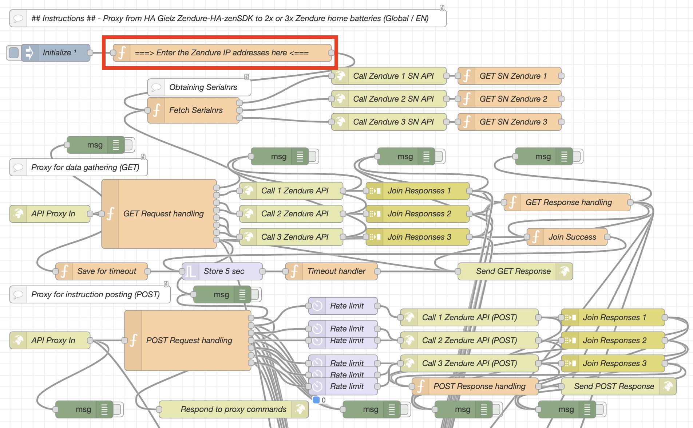
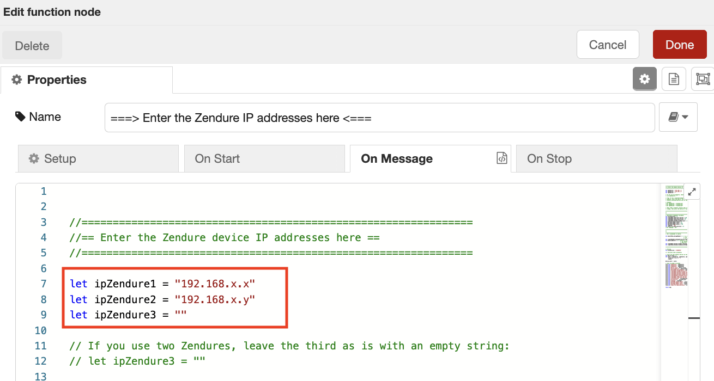

# Zendure-zenSDK-proxy

Choose your preferred language

 [](README.md) [](README.nl.md)<br><br>

The [Gielz automation](https://github.com/Gielz1986/Zendure-HA-zenSDK) for Zendure works well for controlling a Zendure
home battery locally through Home Assistant, eliminating cloud
dependency for batteries that support the ZenSDK API.

A limitation is that the original Gielz automation normally supports only a single Zendure inverter/device at a time.


This Node-RED flow solves that limitation by acting as a proxy server.
It allows two or three Zendure devices (for example, 2× or 3× SolarFlow
2400AC units) to be controlled as if they were one large virtual device.


<br/>

   

<br/>
<br/>


It works as follows: Home Assistant communicates with the proxy instead of directly with a Zendure device. The proxy communicates with the individual Zendure devices and distributes the power commands intelligently across them. From Home Assistant's perspective, the system still appears to be a single Zendure device, but one with two or three times the available power capacity.

Power is distributed intelligently: Devices with a lower SoC (State of Charge) charge faster, while devices with a higher SoC discharge faster. This keeps SoC values closely aligned. At lower power levels, not all devices may be active to improve efficiency.

Node-RED can be easily installed as an App in Home Assistant. After importing this Node-RED Proxy flow, you can enter the IP addresses of your two or three Zendure devices. The section below shows where to do this.

Next, you only need to make a few simple configuration changes to the Gielz automation in Home Assistant, as described in the instructions below. After that, you're ready to go! :)<br/>

The proxy is available in both [English](https://github.com/gast777/Zendure-zenSDK-proxy/tree/main/Global_(EN)_Proxy) and [Dutch](https://github.com/gast777/Zendure-zenSDK-proxy/tree/main/Dutch_(NL)_Proxy). Use the same language as your Gielz automation has.<br/>


## Instructions ##

### Node-RED ###
<br/>

- [ ] Enter the IP addresses of your Zendure devices, in the block "**Enter the Zendure IP addresses here**" (see the red square in the image below).<br/>

To do this you first import the flow Zendure-proxy-Node-Red-flow_XX.json into Node-RED via the menu (hamburger at the right top) -> Import. 

If you get this popup, click on 'Install all'.<br/>

  
  <br/>

Next, open the block "**Enter the Zendure IP addresses here**" by double-clicking on it. After entering the IP addresses, click the "Done" button. Then click the red "Deploy" button at the right top in Node-RED to activate the flow. Now the Node-RED part is completed.<br/>
<br/>

 

 
<br/>
<br/>

### Home Assistant ###
<br/>

<ins>_This instruction assumes that you have at least the May 2026 version of the [Gielz ZenSDK](https://github.com/Gielz1986/Zendure-HA-zenSDK) already installed. If you are using an older version, first update the Gielz._<ins>

<br/>

- [ ] Step 1: On the Gielz HA Dashboard you have the field "Zendure IP-address" available at the Settings tab. Enter the IP address and port of the Node-RED proxy there. For example: 192.168.x.x:1880


If in the blocks for "API Proxy In" it says "The url will be relative to /endpoint", then enter here: IP_address:port/endpoint 

 

If Node-RED is installed on the Home Assistant server itself as an App (formerly 'Add-On'), enter "localhost:1880/endpoint".


After this step, the sensors in the Gielz Dashboard should already work.

<br/>

- [ ] Step 2: On the Gielz Dashboard, Settings Tab, set the total maximum power via the fields "Max Discharge Power" and "Max Charge Power".

For example for 2x SolarFlow 2400+ you can set it to max 4800 Watts. For 3x SolarFlow 2400+ to max 7200 Watts.


With this, the base installation is completed. You can now start using it by selecting an operation mode on the Gielz Dashboard, at the drop-down menu "Zendure Operation Mode". For example choose "Quick Charge" to confirm if that works.
<br/>
<br/>


## Node-RED as a Home Assistant App (formerly 'Add-on') ##

If Node-RED is installed on the Home Assistant server itself as an App, follow these steps to make the flow work:<br/>

1) Home Assistant Add-On configuration of Node-RED:
- Disable "ssl"
- Enable "Show unused optional configuration options"
- Enable "leave_front_door_open"
- Save the configuration
- Restart Node-RED<br/>

2) On the HA Dashboard, configure "Zendure IP-address": <br />
localhost:1880/endpoint<br/>
<br/>


## Monitoring ##

For monitoring the real-time status of the Zendure devices behind the Proxy, the Proxy wil send extra attributes besides the existing attributes of the [Zendure REST API](https://github.com/Zendure/zenSDK/blob/main/docs/en_properties.md). This information can be read by Home Assistant and placed on a dashboard for monitoring the proxy specific items. For example you can see with how much power the proxy lets each Zendure charge or discharge. Or to see the SoC percentages of each individual Zendure device.

See below the extra available proxy specific sensors in Home Assistant.


To make these available in Home Assistant, we will add the extra sensors to the package which [Gielz](https://github.com/Gielz1986/Zendure-HA-zenSDK) provides. Or in the configuration.yaml, if you use that method (the package method is recommended). 

A convenient way to copy and edit the files in Home Assistant is by using the App "File Editor" in Home Assistant.

### Instructions ###

In the Gielz package (zendure_gielz1986_xx.yaml) or the configuration.yaml there are the below lines to indicate where the Proxy sensors should be inserted:
```
####### START - Place here your Node-RED sensors from https://github.com/gast777/Zendure-zenSDK-proxy - START #######


####### END - Place here your Node-RED sensors from https://github.com/gast777/Zendure-zenSDK-proxy - END #######
```

Take the file HA_REST_proxy_sensors_EN (where EN indicates the language, can be EN or NL). Note that the language of the Proxy sensors must be the same as the language of the Gielz-automation and dashboard that you are using.

Copy the text from the file, as in the example below:


Then paste the text between the indicated lines in the Gielz package file.

After a restart of Home Assistant, these entities will be available in Home Assistant.


The next step is to place these sensors on a dashboard. To do that you can add a card (type: entities) and paste the code from the file `dashboard_proxy_sensors_EN` in it. Be sure to take the file from the same language (EN or NL) as in previous steps.

In case you have more than 6 battery packs, which the Gielz Dashboard does not currently support, then you can also add a dashboard card containing the information for all battery packs: `dashboard_battery_sensors_EN`. 

Tip: In case you don't see all the batteries immediately, check if you have the field "Battery Order" filled in. Then empty that field. If needed restart Home Assistant in case still not all batteries are visible.

Now the party can start!

<br/>
<br/>

### Proxy attributes specifications ###

<br/>

 | Attribute | Description |
 |-----------|-------------|
 | `properties.electricLevel_1` | State of Charge of the Zendure 1 |
 | `properties.electricLevel_2` | State of Charge of the Zendure 2 |
 | `properties.electricLevel_3` | State of Charge of the Zendure 3 |
 | `properties.latestPowerCmd` | The power of the most recent command to the proxy to charge or discharge |
 | `properties.latestPowerCmd_1` | The power of the most recent command to Zendure 1 to charge or discharge |
 | `properties.latestPowerCmd_2` | The power of the most recent command to Zendure 2 to charge or discharge |
 | `properties.latestPowerCmd_3` | The power of the most recent command to Zendure 3 to charge or discharge | 
 | `properties.outputHomePower_1` | Power outgoing to the grid (discharge) of Zendure 1 |
 | `properties.outputHomePower_2` | Power outgoing to the grid (discharge) of Zendure 2 |
 | `properties.outputHomePower_3` | Power outgoing to the grid (discharge) of Zendure 3 |
 | `properties.gridInputPower_1` | Power incoming from the grid (charge) of Zendure 1 |
 | `properties.gridInputPower_2` | Power incoming from the grid (charge) of Zendure 2 |
 | `properties.gridInputPower_3` | Power incoming from the grid (charge) of Zendure 3 |
 | `properties.packInputPower_1` | Power coming from the batteries (discharge) of Zendure 1 |
 | `properties.packInputPower_2` | Power coming from the batteries (discharge) of Zendure 2 |
 | `properties.packInputPower_3` | Power coming from the batteries (discharge) of Zendure 3 |
 | `properties.outputPackPower_1` | Power outgoing to the batteries (charge) of Zendure 1 |
 | `properties.outputPackPower_2` | Power outgoing to the batteries (charge) of Zendure 2 |
 | `properties.outputPackPower_3` | Power outgoing to the batteries (charge) of Zendure 3 |
 | `properties.solarInputPower_1` | Vermogen inkomend vanuit de zonnepanelen op Zendure 1 |
 | `properties.solarInputPower_2` | Vermogen inkomend vanuit de zonnepanelen op Zendure 2 |
 | `properties.solarInputPower_3` | Vermogen inkomend vanuit de zonnepanelen op Zendure 3 |
 | `properties.gridOffPower_1` | Power coming out of the offgrid socket of Zendure 1 |
 | `properties.gridOffPower_2` | Power coming out of the offgrid socket of Zendure 2 |
 | `properties.gridOffPower_3` | Power coming out of the offgrid socket of Zendure 3 |
 | `properties.socStatus_1` | Indication if Zendure 1 is currently charging forced by calibration.<br/>Values: 0: No, 1: Calibrating |
 | `properties.socStatus_2` | Indication if Zendure 2 is currently charging forced by calibration.<br/>Values: 0: No, 1: Calibrating |
 | `properties.socStatus_3` | Indication if Zendure 3 is currently charging forced by calibration.<br/>Values: 0: No, 1: Calibrating |
 | `properties.smartMode_1` | smartMode state of Zendure 1.<br/>Values: 0: Smartmode off (write to Flash), 1: Smartmode on (write to RAM) |
 | `properties.smartMode_2` | smartMode state of Zendure 2.<br/>Values: 0: Smartmode off (write to Flash), 1: Smartmode on (write to RAM) |
 | `properties.smartMode_3` | smartMode state of Zendure 3.<br/>Values: 0: Smartmode off (write to Flash), 1: Smartmode on (write to RAM) |
 | `properties.activeDevice` | Active Device.<br/>Values: 0: None, 1: Zendure 1, 2: Zendure 2, 3: Zendure 1 and 2, 4: Zendure 3, 5: Zendure 1 and 3, 6: Zendure 2 and 3, 7: All 3 Zendures |
 | `properties.dualModeDamper` | Dual Mode Damper.<br/>Values: 0: Off, 1: On (read/write) |
 | `properties.alwaysDualMode` | All devices active.<br/>Values: 0: Off, 1: On (read/write) |
 | `properties.equalMode` | Equal Mode. All devices active and use the same power on all devices.<br/>Values: 0: Off, 1: On (read/write) |
 | `properties.proxyNoSleep` | The proxy will not set inactive devices to sleep mode (write to flash). <br/>Values: 0: Off, 1: On (read/write) |
 | `properties.socLimit_1` | SOC-limit Status of the Zendure 1 device.<br/>Values: 0: Normal Operation, 1: Charging Limit Reached, 2: Discharge Limit Reached |
 | `properties.socLimit_2` | SOC-limit Status of the Zendure 2 device.<br/>Values: 0: Normal Operation, 1: Charging Limit Reached, 2: Discharge Limit Reached |
 | `properties.socLimit_3` | SOC-limit Status of the Zendure 3 device.<br/>Values: 0: Normal Operation, 1: Charging Limit Reached, 2: Discharge Limit Reached |
 | `properties.hyperTmp_1` | Temperature of the Zendure 1 inverter |
 | `properties.hyperTmp_2` | Temperature of the Zendure 2 inverter |
 | `properties.hyperTmp_3` | Temperature of the Zendure 3 inverter |
 | `properties.ipAddress_1` | IP address of the Zendure 1 device |
 | `properties.ipAddress_2` | IP address of the Zendure 2 device |
 | `properties.ipAddress_3` | IP address of the Zendure 3 device |
 | `cachedResponse` | Indication if the information came from cache due to a communication issue with the Zendure devices<br/>Values: 0: No, 1: Yes |
 | `sn_1` | Serial number of the inverter of the Zendure 1 device |
 | `sn_2` | Serial number of the inverter of the Zendure 1 device |
 | `sn_3` | Serial number of the inverter of the Zendure 1 device |
 | `proxyVersion` | Version of the Proxy |
<br/>
<br/>


<br/>
<br/>

## More documentation ##


### Automatic Standby mode at lower power levels ###

At lower power values, one of the Zendures will first be set to standby and then after 5 minutes to sleep mode, for efficiency.

With 2 Zendures behind the Proxy the standard thresholds are 40% and 100% of the configured max power of 1 device (which can be different for charging and discharging). So normally for an SF2400AC that will be 40% and 100% of 2400 Watts (960W en 2400W):

below 960W - always 1 device<br/>
above 2400W - always 2 devices<br/>
In between it will stay what it is.<br/>

With 3 Zendures it is the same, but slightly more complicated:

below 960W - always 1 device<br/>
abve 4800W - always 3 devices<br/>
if 1 is active, above 2400W go to 2 devices<br/>
if 3 are active, below 1920W (40% of 4800W) go to 2 devices<br/>

Besides this, they will change active device if the difference in SoC becomes >=5%. If they change/discharge at the same time, the power will balance so that the SoC of the Zendures will stay close to eachother.

<br/>


## Features ##
- The Proxy can connect with 1, 2 or 3 Zendure Devices.
- SoC balancing - The SoC (state of charge) of the Zendure devices will be kept close to eachother by letting the most full battery discharge the fastest and the lowest battery charge the fastest. At equal SoC they will charge at the same speed.
- Repeat of commands to charge/discharge, so that SoC balancing between the Zendures will also work in Manual mode.
- At lower power levels not all the Zendures will charge/discharge at the same time. The active device(s) will be changed based on the SoC of the devices, which will keep the SoC levels close to eachother.
- A non-active device (one that does not charge/discharge at that moment) will be set to sleep mode after 5 minutes (smartMode = 0, "Store in Flash").
- The active device will be switched when the difference in SoC becomes 5%. This will reduce the number of switches of active device (compared to switching at only 1% difference).
- With 2 Zendure devices, when switching over activeness to the other device or when switching from one device to both devices active, there will be a transition period in which there will be two devices used. At the beginning the already active device will be assigned 95% of the power, so that the other one which may come out of sleep mode, will be given time to start up, before it will be assigned more of the power.
<br/>

## Requirements ## 
- 2x or 3x Zendure devices. This can be SolarFlow 2400 AC, SolarFlow 2400 AC+/Pro, SolarFlow 1600 AC+ or Zendure SolarFlow 800 Plus/Pro. In principle a combination of different models will work as well. However it is recommended that all devices have similar kWh battery capacity and the same max power (for example a SolarFlow 2400AC and a SolarFlow 2400AC+).
- The Zendures and the Node-RED server must have a fixed IP address.
- Wifi signal strength must be excellent.
- The Zendures have to be reachable via the network and be operational.
<br/>

## Limitations ##
- Solar panels connected directly via DC to the Zendures should work fine, but has not been tested extensively.
- After a 0 Watt command, a Zendure device may still use or deliver  about 20 Watts. This is Zendure behavior and not an issue with the proxy. When the proxy sets the non-active device to sleep mode (smartMode = 0, "Store in Flash"), this will typically turn to zero Watts.
<br/>


## Version ##

Current version: 20260701
<br/>


