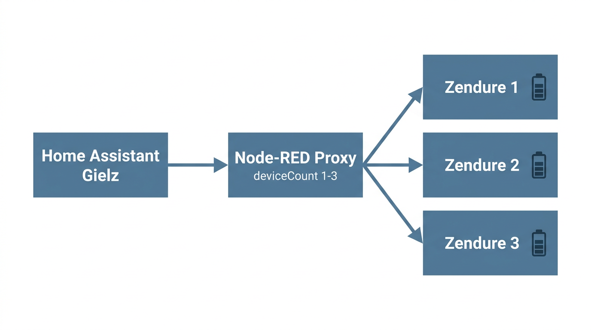
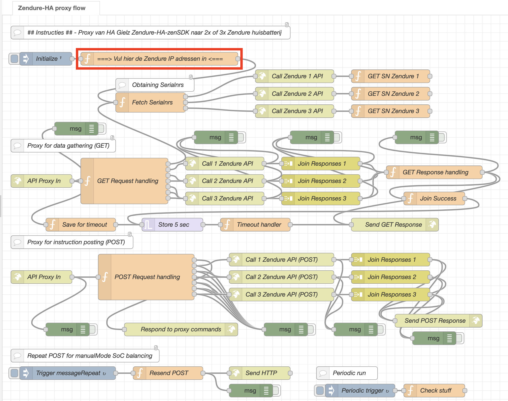
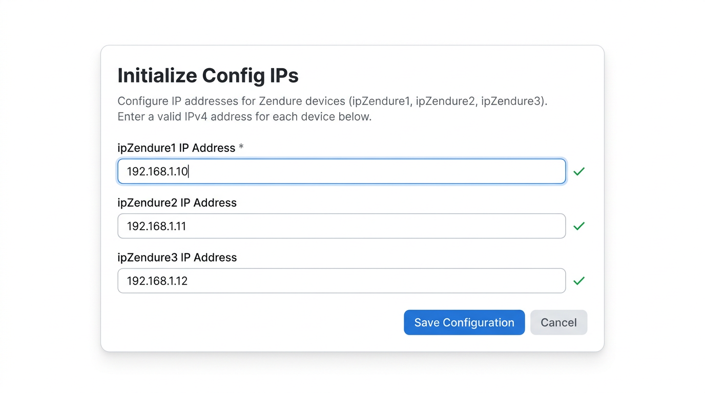

# Zendure-zenSDK-proxy


De [Gielz-automatisering](https://github.com/Gielz1986/Zendure-HA-zenSDK) voor Zendure werkt goed om een Zendure thuisbatterij (die de ZenSDK API ondersteunt) lokaal te bedienen via Home Assistant. Hierdoor is de batterij niet meer afhankelijk van een verbinding met de cloud.

Een nadeel is dat de Gielz-automatisering normaal maar één Zendure-apparaat (omvormer) tegelijk ondersteunt.

Deze Node-RED flow lost dat op. Het werkt als een tussenstation (proxy server) waarmee je twee of drie Zendure-apparaten, bijvoorbeeld 2x of 3x [SolarFlow 2400AC](https://www.zendure.nl/products/zendure-solarflow-2400-ac), kunt aansturen alsof het één groot apparaat is.

<br/>

   

<br/>
<br/>


Het werkt als volgt: Home Assistant (HA) zal met de proxy praten, in plaats van met een Zendure. De proxy praat met de twee of drie Zendure devices. Vanuit HA (Gielz) gezien lijkt het nog steeds alsof er maar één Zendure device is, maar dan wel eentje die twee of drie keer zo veel vermogen aan kan (een virtuele SolarFlow 4800AC dus). De proxy verdeelt het vermogen dat HA (Gielz) aanstuurt over de twee fysieke Zendures.

Het vermogen wordt op intelligente wijze verdeeld over de Zendures. Als er een verschil is in SoC (State of Charge, batterij % Laadpercentage) van de Zendures, dan zal degene met de laagste SoC sneller laden of de volste juist sneller ontladen. Zo blijft de SoC van de beide Zendures dicht bij elkaar. Tevens zal bij lagere vermogens slechts één of twee van de Zendures tegelijk gaan laden/ontladen, om redenen van efficiency.

Node-RED kan gemakkelijk als een App geinstalleerd worden in Home Assistant. Na importeren van deze Node-RED Zendure Proxy flow, kun je de IP adressen van je twee of drie Zendure devices invullen. Hieronder staat aangegeven waar je dat kunt doen.

Vervolgens moet je een paar eenvoudige instellingen doen voor de Gielz automatisering in Home Assistant, zoals in onderstaande instructies te zien is. Daarna kan hij aan het werk :)<br/>

De Proxy is zowel in het [Nederlands](https://github.com/gast777/Zendure-zenSDK-proxy/tree/main/Dutch_(NL)_Proxy) als in het [Engels](https://github.com/gast777/Zendure-zenSDK-proxy/tree/main/Global_(EN)_Proxy) beschikbaar, net als de Gielz-automatisering. Neem altijd dezelfde taal voor de Proxy als voor de Gielz-automatisering.
<br/>


## Instructies ##

### Node-RED ###
<br/>

- [ ] Vul de IP adressen van de Zendure devices in, in het blok "**Vul hier de Zendure IP adressen in**" (zie het rode vierkant in het plaatjes hieronder).<br/>

Hiervoor importeer je eerst de flow Zendure-proxy-Node-Red-flow_XX.json in Node-RED via het menu (hamburger rechtsboven) -> Import. Vervolgens open je het blok "**Vul hier de Zendure IP adressen in**" door erop te dubbel clicken. Na invullen van de IP adressen click je op de rode "Done" knop. Daarna click je op de rode "Deploy" knop rechts boven in Node-RED om de flow te activeren. Daarmee is de Node-RED kant gereed.<br/>
<br/>

 

 
<br/>
<br/>

### Home Assistant ###
<br/>

<ins>_Deze instructie gaat ervan uit dat je minimaal de Maart 2026 versie van de [Gielz ZenSDK](https://github.com/Gielz1986/Zendure-HA-zenSDK) gebruikt. Mocht je een eerdere versie gebruiken, update de Gielz dan eerst._<ins>

<br/>

- [ ] Stap 1: Op het HA Dashboard van Gielz heb je het invulveld "Zendure 2400 AC IP-adres" beschikbaar, als onderdeel van de Gielz instructies. Vul het IP adres en poort van de Node-RED proxy daar in. Bijvoorbeeld: 192.168.x.x:1880


Als in de blokken "API Proxy In" staat "The url will be relative to /endpoint", dan vul hier in IP_adres:poort/endpoint 

 

Als Node-RED op de Home Assistant server zelf is geinstalleerd als App (voorheen 'Add-On'), vul in "localhost:1880/endpoint".


Na deze stap zouden de sensoren van Gielz in Home Assistant al moeten werken.

<br/>

- [ ] Stap 2: Op het dashboard, stel het maximale vermogen in via de invulvelden "Max. Ontlaadvermogen" en "Max. Oplaadvermogen".

Bijvoorbeeld voor 2x SolarFlow 2400 kun je hem op max 4800 Watt zetten. Bij 3x SolarFlow 2400 op max 7200 Watt (gebruik dan minimaal de Mei 2026 versie van Gielz).


Hiermee is de basis installatie gereed. Je kunt hem nu in gebruik nemen door een aansturing te kiezen op het dashboard drop-down menu "Zendure 2400 AC Modus Selecteren". Kies bijvoorbeeld "Snel opladen" om te testen of dat werkt.
<br/>
<br/>


## Node-RED als Home Assistant App (voorheen 'Add-on') ##

Indien Node-RED op de Home Assistant server zelf is geinstalleerd als App, volg deze stappen om de flow direct te laten werken:<br/>

1) Home Assistant Add-On Configuratie van Node-RED:
- Zet "ssl" uit
- Zet "Show unused optional configuration options" aan
- Zet "leave_front_door_open" aan
- Save de configuratie
- Herstart Node-RED<br/>

2) Op het HA Dashboard, configureer als "Zendure 2400 AC IP-adres": <br />
localhost:1880/endpoint<br/>
<br/>


## Monitoring ##

Om real-time de status van de Zendure devices achter de Proxy te kunnen monitoren, stuurt de Proxy behalve de bestaande attributen van de [REST API van Zendure](https://github.com/Zendure/zenSDK/blob/main/docs/en_properties.md) ook nog extra attributen mee. Deze kunnen in Home Assistant toegevoegd worden en op het dashboard geplaatst worden. Bijvoorbeeld om inzicht te hebben met welk vermogen de proxy opdracht wordt gegeven te laden/ontladen en hoe dat vervolgens over de verschillende Zendure devices verdeeld wordt. Of om bijvoorbeeld de SoC percentages van de individuele Zendure devices te kunnen zien. 

Zie hier de beschikbare extra proxy sensoren in Home Assistant.


Om deze in Home Assistant beschikbaar te maken, voegen we de extra sensoren toe aan de package die [Gielz](https://github.com/Gielz1986/Zendure-HA-zenSDK) beschikbaar stelt. Of in de configuration.yaml, als je die methode gebruikt (de package methode van Gielz is aan te raden). 

Een handige manier om de bestanden te editen is door middel van de App "File Editor" in Home Assistant.

### Instructie ###

In de package van Gielz (zendure_gielz1986_xx.yaml) of de configuration.yaml staan de volgende regels om aan de geven waar de Proxy sensoren ingevoegd kunnen worden:
```
####### BEGIN - Plaats hier je Node-RED sensoren tussen van https://github.com/gast777/Zendure-zenSDK-proxy - BEGIN #######


####### EIND - Plaats hier je Node-RED sensoren tussen van https://github.com/gast777/Zendure-zenSDK-proxy - EIND ####### 
```

Neem het bestand HA_REST_proxy_sensors_XX (waar XX de taal aangeeft, NL of EN). De taal van de Proxy sensoren moet dezelfde zijn als die van de Gielz-automatisering en dashboard die je in gebruik hebt.

Kopieer de tekst van het bestand, zoals in inderstaand voorbeeld.


Dan plak de tekst tussen de aangegeven regels in de Gielz package.

Na herstart van Home Assistant kunnen deze entiteiten vervolgens aan het dashboard worden toegevoegd en gemonitord.


De volgende stap is om de sensoren op een dashboard te zetten. Daarvoor kun je een kaart (type: entiteiten) toevoegen en de code uit het bestand `dashboard_proxy_sensors_XX` erin plakken. Neem die van dezelfde taal als in de voorgaande stappen.

Als je in totaal meer dan 6 batterijmodules hebt, dan kun je ook nog een dashboard kaart toevoegen met de informatie over alle batterijen (het standaard Gielz dashboard toont maximaal 6 batterijen): `dashboard_battery_sensors_XX`. 

Als je vervolgens niet meteen alle batterijen ziet, controleer of je "Batterij Volgorde" hebt ingevuld. Maak die dan leeg. Eventueel kun je HA herstarten mochten nog niet alle batterijen zichtbaar zijn.

_NB: Momenteel werkt "Batterij Volgorde" nog maar tot maximaal 6 batterijen. Wil je het gebruiken met meer dan 6 batterijen, doe dan deze eenvoudige aanpassing in de de Gielz package. Verander in de volgende tekst "11" naar "44":_

```
input_text:
  zendure_2400_ac_batterij_volgorde:
    name: Zendure 2400 AC Batterij Volgorde
    icon: mdi:flip-vertical
    max: 11    <<<<<<< verander deze naar 44
    mode: text
```

Nu kan het feest beginnen!

<br/>
<br/>

### Proxy attributen specificatie ###

<br/>

 | Attribuut | Beschrijving |
 |-----------|-------------|
 | `properties.electricLevel_1` | Laadpercentage van de Zendure 1 |
 | `properties.electricLevel_2` | Laadpercentage van de Zendure 2 |
 | `properties.electricLevel_3` | Laadpercentage van de Zendure 3 |
 | `properties.latestPowerCmd` | Het vermogen van de meest recente opdracht aan de proxy om te laden of ontladen |
 | `properties.latestPowerCmd_1` | Het vermogen van de meest recente opdracht aan de Zendure 1 om te laden of ontladen |
 | `properties.latestPowerCmd_2` | Het vermogen van de meest recente opdracht aan de Zendure 2 om te laden of ontladen |
 | `properties.latestPowerCmd_3` | Het vermogen van de meest recente opdracht aan de Zendure 3 om te laden of ontladen | 
 | `properties.outputHomePower_1` | Vermogen uitgaand naar het net (ontladen) van Zendure 1 |
 | `properties.outputHomePower_2` | Vermogen uitgaand naar het net (ontladen) van Zendure 2 |
 | `properties.outputHomePower_3` | Vermogen uitgaand naar het net (ontladen) van Zendure 3 |
 | `properties.gridInputPower_1` | Vermogen inkomend van het net (laden) van Zendure 1 |
 | `properties.gridInputPower_2` | Vermogen inkomend van het net (laden) van Zendure 2 |
 | `properties.gridInputPower_3` | Vermogen inkomend van het net (laden) van Zendure 3 |
 | `properties.packInputPower_1` | Vermogen komend vanuit de batterijen (ontladen) van Zendure 1 |
 | `properties.packInputPower_2` | Vermogen komend vanuit de batterijen (ontladen) van Zendure 2 |
 | `properties.packInputPower_3` | Vermogen komend vanuit de batterijen (ontladen) van Zendure 3 |
 | `properties.outputPackPower_1` | Vermogen uitgaand naar de batterijen (laden) van Zendure 1 |
 | `properties.outputPackPower_2` | Vermogen uitgaand naar de batterijen (laden) van Zendure 2 |
 | `properties.outputPackPower_3` | Vermogen uitgaand naar de batterijen (laden) van Zendure 3 |
 | `properties.socStatus_1` | Indicatie of het Zendure 1 device geforceerd aan het opladen is vanwege kalibratie.<br/>Waarden: 0: Nee, 1: Kalibreren |
 | `properties.socStatus_2` | Indicatie of het Zendure 2 device geforceerd aan het opladen is vanwege kalibratie.<br/>Waarden: 0: Nee, 1: Kalibreren |
 | `properties.socStatus_3` | Indicatie of het Zendure 3 device geforceerd aan het opladen is vanwege kalibratie.<br/>Waarden: 0: Nee, 1: Kalibreren |
 | `properties.smartMode_1` | smartMode status van Zendure 1.<br/>Waarden: 0: Smartmode uit (schrijven naar Flash), 1: Smartmode aan (schrijven naar RAM) |
 | `properties.smartMode_2` | smartMode status van Zendure 2.<br/>Waarden: 0: Smartmode uit (schrijven naar Flash), 1: Smartmode aan (schrijven naar RAM) |
 | `properties.smartMode_3` | smartMode status van Zendure 3.<br/>Waarden: 0: Smartmode uit (schrijven naar Flash), 1: Smartmode aan (schrijven naar RAM) |
 | `properties.activeDevice` | Actief Device.<br/>Waarden: 0: Beide, 1: Zendure 1, 2: Zendure 2, -1: Geen |
 | `properties.dualModeDamper` | Dual Mode Demper.<br/>Waarden: 0: Uit, 1: Aan (read/write) |
 | `properties.alwaysDualMode` | Beide Actief. Altijd Dual Mode gebruiken. Single Mode uitgeschakeld.<br/>Waarden: 0: Uit, 1: Aan (read/write) |
 | `properties.equalMode` | Synchroon Laden. Altijd Dual Mode gebruiken en steeds hetzelfde vermogen op beide devices.<br/>Waarden: 0: Uit, 1: Aan (read/write) |
 | `properties.socLimit_1` | SOC-limiet Status van het Zendure 1 device.<br/>Waarden: 0: Normale werking, 1: Oplaadlimiet bereikt, 2: Ontlaadlimiet bereikt |
 | `properties.socLimit_2` | SOC-limiet Status van het Zendure 2 device.<br/>Waarden: 0: Normale werking, 1: Oplaadlimiet bereikt, 2: Ontlaadlimiet bereikt |
 | `properties.socLimit_3` | SOC-limiet Status van het Zendure 3 device.<br/>Waarden: 0: Normale werking, 1: Oplaadlimiet bereikt, 2: Ontlaadlimiet bereikt |
 | `properties.hyperTmp_1` | Omvormertemperatuur van het Zendure 1 device. |
 | `properties.hyperTmp_2` | Omvormertemperatuur van het Zendure 2 device. |
 | `properties.hyperTmp_3` | Omvormertemperatuur van het Zendure 3 device. |
 | `sn_1` | Serienummer van de omvormer van het Zendure 1 device. |
 | `sn_2` | Serienummer van de omvormer van het Zendure 2 device. |
 | `sn_3` | Serienummer van de omvormer van het Zendure 3 device. |
 | `proxyVersion` | Versie van de Proxy. |
<br/>
<br/>

### Optioneel: Nog meer per device monitoren? ###

<details>
<summary>Open deze sectie.</summary>

<br/>

Het is onwaarschijnlijk, maar zou je nog meer details per device willen monitoren, die niet per device door de proxy worden doorgegeven en die minder real-time hoeven te zijn? Dan kun je eenvoudig een minder frequente REST polling toevoegen in je configuration.yaml (of in een aparte package, niet in de Gielz package). Deze verbindt rechtstreeks naar de Zendure devices IP adressen, dus niet via de proxy.<br/>

<br/>
Voorbeeld:
<br/>

```
rest:

  - resource: http://192.168.x.x/properties/report
    scan_interval: 120
    sensor:

      - name: "Zendure 1 Signaalsterkte"
        value_template: >
          
          
            Uitstekend
          
            Goed
          
            Zwak
          
            Slecht
          
        unique_id: Zendure_1_Signaalsterkte
        icon: mdi:wifi

      - name: "Zendure 1 Error"
        value_template: >
          
          
          {{ states.get(packState, "Onbekend") }}
        unique_id: Zendure_1_Error
        icon: mdi:battery-alert


  - resource: http://192.168.x.y/properties/report
    scan_interval: 120
    sensor:

      - name: "Zendure 2 Signaalsterkte"
        value_template: >
          
          
            Uitstekend
          
            Goed
          
            Zwak
          
            Slecht
          
        unique_id: Zendure_2_Signaalsterkte
        icon: mdi:wifi

      - name: "Zendure 2 Error"
        value_template: >
          
          
          {{ states.get(packState, "Onbekend") }}
        unique_id: Zendure_2_Error
        icon: mdi:battery-alert
        
```
NB: voeg geen hoog frequente polling toe, om de Zendure devices niet te overbelasten met te veel verzoeken.
<br/>
<br/>
NB: van de attributen in bovenstaand voorbeeld wordt reeds de laagste (slechtste) waarde van de beide devices door de proxy doorgegeven in het reguliere attribuut (rssi / is_error) van het virtuele device. Dus als er een probleem is, zul je dat ook zonder deze extra configuratie kunnen zien.


<br/>
<br/>

**Tip**: om te zien welke attributen er beschikbaar zijn om te monitoren, kun je in Node-RED de debug node (groen blokje) even aanzetten die verbonden is met het blok "Join Responses" of "Call Zendure 1 API". Vervolgens verschijnen de messages rechts in het debug venster (de tab met het kevertje). Deze messages kun je uitvouwen om te zien welke informatie erin meegestuurd wordt.
<br/>
<br/>
</details>

<br/>

### Optioneel: Dual Mode Demper ###

<details>
<summary>Open deze sectie.</summary>

<br/>


De Dual Mode Demper voorkomt dat dual mode direct ingeschakeld wordt bij een kortstondige piek tijdens het ontladen. Bijvoorbeeld de korte vermogenspiek van een keukenboiler 's nachts tijdens NOM. Deze demper kan voorkomen dat het niet actieve device onnodig wakker gemaakt wordt uit slaapmodus (smartmode=0) voor een kortstondige vermogenspiek.

De status (Aan/Uit) van de Dual Mode Demper kan uitgelezen worden via de sensor __sensor.dual_mode_demper_status__.

De maximale tijd en hoogte van de demping kan alleen ingesteld worden in de Node-RED flow in het blokje "Vul hier de Zendure IP adressen in". Standaard werkt deze functie maximaal 60 seconden per piek en bij een maximale overschrijding van 150 Watt. Bij een langduriger of hogere vermogenspiek zal wel gewoon naar dual mode overgeschakeld worden.

Standaardinstellingen, aan te passen in het blokje "Vul hier de Zendure IP adressen in": <br/>
<br/>
```
let dualmode_damper_enable = 0      // Dual-mode Demper staat standaard uit
let dualmode_damper_timer = 60      // seconden
let dualmode_damper_amount = 150    // Watt
```

De Dual-mode Demper werkt alleen tijdens ontladen, niet tijdens laden.

Deze demper kan op verschillende manieren in en uitgeschakeld worden:

<br/>

#### ==> Via een toggle switch op het dashboard ####

<br/>


<br/>
<br/>
Hoe te installeren:

1) De REST sensoren van [Monitoring](https://github.com/gast777/Zendure-zenSDK-proxy/tree/main?tab=readme-ov-file#monitoring) moeten geinstalleerd zijn in de Gielz package of in de configuration.yaml. Het handigst is om de Gielz Package te gebruiken. Zie de [instructie van Gielz](https://github.com/Gielz1986/Zendure-HA-zenSDK/tree/main?tab=readme-ov-file#%EF%B8%8F%E2%83%A3-configuratie-en-herstart) hoe die te installeren.
2) Voeg de volgende items toe aan configuration.yaml of een aparte package (niet aan de Gielz package).

```
template:

  - switch:

      - name: "Dual Mode Demper"
        unique_id: Zendure_proxy_dualModeDamper_switch
        state: >
          {{ is_state('sensor.dual_mode_demper_status', 'Aan') }}
        icon: mdi:speedometer-medium
        turn_on:
          - service: rest_command.set_dualmodedamper_on
        turn_off:
          - service: rest_command.set_dualmodedamper_off


rest_command:

  set_dualmodedamper_on:
    url: http://{{ states('input_text.zendure_2400_ac_ip_adres') }}/properties/write
    method: POST
    content_type: "application/json"
    payload: >
      {
        "properties": {
          "dualModeDamper": {{ 1 }}
        }
      }

  set_dualmodedamper_off:
    url: http://{{ states('input_text.zendure_2400_ac_ip_adres') }}/properties/write
    method: POST
    content_type: "application/json"
    payload: >
      {
        "properties": {
          "dualModeDamper": {{ 0 }}
        }
      }
```

3) Herstart Home Assistant
4) Zet de toggle switch `switch.dual_mode_demper` op je dashboard.


<br/>

#### ==> Via een automation die de Dual Mode Demper altijd aan houdt ####

Als je de Dual Mode Demper altijd aan wilt laten staan, ook na her-instalatie van de Proxy Node-RED flow en na restart van Node-RED, dan kun je deze automation gebruiken samen met een rest command.

1) Voeg dit rest command toe aan configuration.yaml of een aparte package (niet aan de Gielz package).

```
rest_command:

  set_dualmodedamper_on:
    url: http://{{ states('input_text.zendure_2400_ac_ip_adres') }}/properties/write
    method: POST
    content_type: "application/json"
    payload: >
      {
        "properties": {
          "dualModeDamper": {{ 1 }}
        }
      }
```

2) Voeg de volgende automation toe (Settings -> Automations & Scenes, Create New Automation, Edit in Yaml)

```
alias: Zendure Proxy - Dual Mode Demper altijd aan
description: ""
triggers:
  - trigger: state
    entity_id:
      - sensor.dual_mode_demper_status
    to:
      - Uit
conditions: []
actions:
  - action: rest_command.set_dualmodedamper_on
    data: {}
mode: single
```

<br/>

#### ==> In de Node-RED flow in het blokje "Vul hier de Zendure IP adressen in" ####

Verander ```let dualmode_damper_enable = 0``` naar ```let dualmode_damper_enable = 1```

Dit moet dan wel weer opnieuw ingesteld worden na upgrade van de Proxy flow in Node-RED.


</details>

<br/>

### Optioneel: Beide Actief en Synchroon Laden ###

<details>
<summary>Open deze sectie.</summary>

<br/>

Met de instelling _Beide Actief_ ingeschakeld zullen beide Zendures actief blijven, dus altijd in dual mode blijven. 
De instelling _Synchroon Laden_ is hetzelfde als _Beide Actief_ maar waarbij dan ook nog de beide Zendure devices steeds met hetzelfde vermogen opladen of ontladen.

Deze twee features zullen niet zinvol zijn voor 99% van de gebruikers. Echter in bepaalde gevallen zou het wenselijk kunnen zijn om deze mogelijkheden te hebben.

Deze twee instellingen kunnen eenvoudig bediend worden via een toggle switch op het dashboard.
<br/>
<br/>


<br/>
<br/>
Hoe te installeren:

1) De REST sensoren van [Monitoring](https://github.com/gast777/Zendure-zenSDK-proxy/tree/main?tab=readme-ov-file#monitoring) moeten geinstalleerd zijn in de Gielz package of in de configuration.yaml. Het handigst is om de Gielz Package te gebruiken. Zie de [instructie van Gielz](https://github.com/Gielz1986/Zendure-HA-zenSDK/tree/main?tab=readme-ov-file#%EF%B8%8F%E2%83%A3-configuratie-en-herstart) hoe die te installeren.
2) Voeg de volgende items toe aan configuration.yaml (niet aan de Gielz package, kan wel in een aparte package).

```

template:

  - switch:

      - name: "Beide Actief"
        unique_id: Zendure_proxy_alwaysDualMode_switch
        state: >
          {{ is_state('sensor.beide_actief_status', 'Aan') }}
        icon: mdi:format-columns
        turn_on:
          - service: rest_command.set_alwaysdualmode_on
        turn_off:
          - service: rest_command.set_alwaysdualmode_off

      - name: "Synchroon Laden"
        unique_id: Zendure_proxy_equalMode_switch
        state: >
          {{ is_state('sensor.synchroon_laden_status', 'Aan') }}
        icon: >
          
            mdi:battery-sync
          
            mdi:battery-sync-outline
          
        turn_on:
          - service: rest_command.set_equalmode_on
        turn_off:
          - service: rest_command.set_equalmode_off


rest_command:

  set_alwaysdualmode_on:
    url: http://{{ states('input_text.zendure_2400_ac_ip_adres') }}/properties/write
    method: POST
    content_type: "application/json"
    payload: >
      {
        "properties": {
          "alwaysDualMode": {{ 1 }}
        }
      }

  set_alwaysdualmode_off:
    url: http://{{ states('input_text.zendure_2400_ac_ip_adres') }}/properties/write
    method: POST
    content_type: "application/json"
    payload: >
      {
        "properties": {
          "alwaysDualMode": {{ 0 }}
        }
      }

  set_equalmode_on:
    url: http://{{ states('input_text.zendure_2400_ac_ip_adres') }}/properties/write
    method: POST
    content_type: "application/json"
    payload: >
      {
        "properties": {
          "equalMode": {{ 1 }}
        }
      }

  set_equalmode_off:
    url: http://{{ states('input_text.zendure_2400_ac_ip_adres') }}/properties/write
    method: POST
    content_type: "application/json"
    payload: >
      {
        "properties": {
          "equalMode": {{ 0 }}
        }
      }
```

3) Herstart Home Assistant
4) Zet de toggle switches `switch.beide_actief` en `switch.synchroon_laden` op je dashboard.

Als je nu de switch _Beide Actief_ aan zet, zullen beide Zendures actief blijven. Als de switch _Synchroon Laden_ aangezet wordt, zullen beide Zendures ook steeds met hetzelfde vermogen laden en ontladen.

</details>


<br/>
<br/>

## Meer documentatie ##


### Automatische Standby mode bij lagere vermogens ###

Bij lage belasting wordt een van de Zendures eerst in standby en dan na 5 minuten in een slaap modus gezet, ten behoeve van de efficiëntie.

Bij 2 Zendures achter de Proxy zijn de standaard grenzen 40% en 100% van het als maximum ingestelde vermogen van 1 device (wat verschillend kan zijn voor opladen en ontladen). Normaliter is dat bij een SF2400AC dus 40% en 100% van 2400 Watt (960W en 2400W):

onder 960W - altijd 1 device<br/>
boven 2400W - altijd 2 devices<br/>
Daar tussenin blijft het zoals het is.<br/>

Bij 3 Zendures hetzelfde, maar wat ingewikkelder:

onder 960W - altijd 1 device<br/>
boven 4800W - altijd 3 devices<br/>
als 1 actief is, boven de 2400W naar 2 devices<br/>
als 3 actief zijn, onder de 1920W (40% van 4800W) naar 2 devices<br/>

Daarnaast wisselen ze van actief device als het verschil in SoC >=5% wordt. En als ze tegelijk laden/ontladen, balanceert het vermogen, zodat de SoC dicht bij elkaar blijft. 

<br/>


## Features ##
- De Proxy kan verbinden met 2 of 3 Zendure devices.
- SoC balancering - De SoC (state of charge, laadpercentage) van de Zendure devices wordt dicht bij elkaar gehouden doordat de volste batterij het snelst ontlaadt en de leegste batterij het snelst oplaadt. Bij gelijke SoC laden ze even snel.
- Herhaling van instructies om te laden/ontladen, zodat SoC balancing tussen de Zendures ook werkt voor Handmatige mode.
- Single Mode - Bij lagere vermogens laadt/ontlaadt slechts een of twee van de Zendures tegelijk. Dit wordt afgewisseld aan de hand van de SoC van de devices, waardoor de SoC waardes bij elkaar in de buurt blijven.
- In Single Mode wordt een passieve device (degene die op dat moment niet laadt of ontlaadt) na 5 minuten op standby gezet (smartMode = 0, "Opslaan in Flash").
- In Single Mode wordt naar het andere device overgeschakeld wanneer het verschil in SoC 5% is. Hierdoor wordt minder vaak overgeschakeld van actief device.
- Bij het overschakelen naar het andere device of van Single Mode naar Dual Mode overschakelen, worden tijdens de overgangsperiode twee devices gebruikt. In het begin krijgt het reeds actieve device 95% van het vermogen toebedeeld, zodat de andere de tijd krijgt om op te starten, voordat die meer vermogen toebedeeld krijgt.
<br/>

## Vereisten ## 
- 2x of 3x Zendure SolarFlow 2400 AC (of SolarFlow 2400 AC+/Pro, SolarFlow 1600 AC+ of Zendure SolarFlow 800 Plus/Pro). In principe zal een combinatie van twee verschillende modellen ook werken. Wel is het aan te bevelen dat beide devices ongeveer dezelfde hoeveelheid kWh aan batterijopslag en hetzelfde max vermogen hebben (bijvoorbeeld een SolarFlow 2400AC en een SolarFlow 2400AC+).
- Zorg dat op beide Zendures hetzelfde maximale en minimale laadpercentage (SoC percentages) ingesteld staan. Dit kan via de Zendure App.
- Beide Zendures moeten hetzelfde aantal batterijen hebben of ongeveer dezelfde hoeveelheid kWh aan batterijopslag.
- De beide Zendures en de Node-RED server moeten een vast IP adres hebben.
- Wifi ontvangst moet uitstekend zijn.
- Beide Zendures moeten beschikbaar zijn via het netwerk en werken.
<br/>

## Beperkingen ##
- Zonnepanelen direct via DC aangesloten op de Zendures zijn niet getest. Het zou in principe wel moeten werken.
- Bij een instructie van 0 Watt laden levert een Zendure device soms rond de 20 Watt. Dit is momenteel Zendure gedrag en geen probleem. Dit wordt op 0 gezet zodra het passieve device automatisch op standby gezet wordt (smartMode = 0, "Opslaan in Flash").
- Met Node-RED 4.0.9 zijn er door een gebruiker problemen gerapporteerd, die met versie 4.1.2 niet meer optraden (thanks [Freemann](https://tweakers.net/gallery/45846/)). Node-RED versie 4.1.1 en 4.1.4 zijn ook getest en werken prima.
<br/>


## Versie ##

Huidige versie: 20260420
<br/>

# Release-notes #

## Nieuw in versie 20260201 ##

- De product string die via de GET requests wordt doorgegeven aan Home Assistant (in properties.product) zal nu in plaats van "PROXY-NODE-RED" de daadwerkelijke product string van de Zendure devices zijn, zoals "solarFlow2400AC". Deze verandering is nodig omdat vanaf de Gielz Maart 2026 versie deze string gebruikt zal worden om de capaciteit van de batterijen te bepalen.
- Het maximale vermogen dat aan de devices gevraagd zal worden, wordt nu automatisch aangepast aan het ingestelde Max. Oplaadvermogen en Max. Ontlaadvermogen. Dit kan nu afwijken van 4800 Watt. Als bijvoorbeeld 3600 Watt als Max. Oplaadvermogen wordt ingesteld, zal op beide Zendure devices 1800 Watt (ieder de helft) ingesteld worden. Ook zal de proxy dan maximaal 1800 Watt aan ieder device vragen te laden en daarmee rekening houden bij het verdelen van het vermogen.
- Het Max. Oplaadvermogen en Max. Ontlaadvermogen kunnen nu verschillend zijn en de proxy zal daar rekening mee houden.
- Als het Max. Oplaadvermogen en Max. Ontlaadvermogen verschillend zijn, zal ook het absolute vermogen afgeleid van de singleMode_upperlimit_percent en singleMode_lowerlimit_percent verschillend zijn. De limieten zijn standaard respectievelijk 100% en 40% van het max vermogen voor opladen of ontladen. De absolute waarden zullen nu dus per richting kunnen verschillen met het max vermogen. Deze bepalen wanneer er wordt omgeschakeld tussen 1 of 2 devices tegelijk gebruiken om te laden/ontladen.
- Als het het Max. Oplaadvermogen of Max. Ontlaadvermogen op de beide Zendure devices niet hetzelfde is ingesteld, zal er nu een waarschuwing gelogd worden in Node-RED.

## Nieuw in versie 20260206 ##

- In Node-RED wordt nu een duidelijke waarschuwing in het debug venster gegeven als de twee Zendure devices niet hetzelfde ingesteld zijn wat betreft Minimale/Maximale Laadpercentage (SoC%) of Minimale/Maximale Oplaadvermogen/Ontlaadvermogen. Om onnodige meldingen te voorkomen op het moment van aanpassen van deze instellingen, verschijnen deze logs niet direct, maar pas als de error situatie een tijdje aanwezig is.
- Kleine optimalisaties in gedrag.

## Nieuw in versie 20260209 ##
- Vanaf nu worden de omvormertemperatuur en de serienummers van de beide Zendures standaard meegestuurd via de REST API en zijn dus beschikbaar in Home Assistant. Ook zijn de sensoren daarvoor toegevoegd aan de lijst onder [Monitoring](https://github.com/gast777/Zendure-zenSDK-proxy/tree/main?tab=readme-ov-file#monitoring).

## Nieuw in versie 20260211 ##
- Enkele checks toegevoegd om nuttige foutmeldingen te kunnen geven wanneer nodig.
- Instructies blok up-to-date gebracht en vereenvoudigd.

## Nieuw in versie 20260212 ##
- _Actief Device_ toont nu _Geen_ wanneer de huidige vermogensopdracht nul is. Om dit correct te tonen in Home Assistant is ook de REST sensor "Zendure Actief Device" aangepast. De nieuwe benodigde REST sensor configuratie is hierboven te zien onder [Monitoring](https://github.com/gast777/Zendure-zenSDK-proxy/tree/main?tab=readme-ov-file#monitoring).

## Nieuw in versie 20260213 ##
- Vanaf deze versie hoeven de serienummers niet meer te worden ingevuld bij installatie van de Node-RED flow. Alleen de beide IP adressen moeten ingevuld worden. Node-RED zal nu zelf de serienummers van de twee Zendures uitlezen en gebruiken.

## Nieuw in versie 20260215 ##
- "Zendure 1 Vermogen Aansturing" en "Zendure 2 Vermogen Aansturing" zijn nu toegevoegd aan de sensoren voor Home Assistant, zie [Monitoring](https://github.com/gast777/Zendure-zenSDK-proxy/tree/main?tab=readme-ov-file#monitoring).
- De outputPackPower en packInputPower wordt nu voor beide Zendures meegestuurd door de proxy.

## Nieuw in versie 20260217 ##
- Ondersteuning toegevoegd voor "Synchroon Laden". Daarmee kan indien gewenst geforceerd worden dat beide Zendure devices steeds met hetzelfde vermogen laden.

## Nieuw in versie 20260219 ##
- Issue opgelost waarbij de overgang van single mode naar dual mode niet vloeiend verliep
- Kleine verbeteringen

## Nieuw in versie 20260220 ##
- Vanaf deze versie worden de Zendure attributen _outputHomePower_ en _gridInputPower_ doorgegeven.
- Ondersteuning toegevoegd voor "Beide Actief". Daarmee kan indien gewenst geforceerd worden dat altijd beide Zendure devices actief zijn, dus altijd dual mode gebruiken. Ze kunnen daarbij nog wel verschillende vermogens hebben, om de Laadpercentages bij elkaar in de buurt te houden.

## Nieuw in versie 20260223 ##
- Het versienummer van de Proxy wordt nu via de REST naar Home Assistant gestuurd. De REST sensor voor Home Assistant om de huidige Proxy versie (sensor.zendure_proxy_versie) te kunnen zien is toegevoegd aan de lijst onder [Monitoring](https://github.com/gast777/Zendure-zenSDK-proxy/tree/main?tab=readme-ov-file#monitoring).

## Nieuw in versie 20260228 ##
- Nu worden ook de Zendure attributen _outputHomePower_ en _gridInputPower_ ook afzonderlijk voor ieder device doorgegeven via _gridInputPower_1_ / _gridInputPower_2_ en _outputHomePower_1_ / _outputHomePower_2_. Deze worden nu gebruikt voor de Home Assistant sensoren "Zendure 1 Vermogen Aansturing" en "Zendure 2 Vermogen Aansturing", zie [Monitoring](https://github.com/gast777/Zendure-zenSDK-proxy/tree/main?tab=readme-ov-file#monitoring).
- De berekening van electricLevel (SoC %) die wordt doorgegeven aan Home Assistant is geoptimaliseerd voor een specifieke situatie. Wanneer een van de twee Zendures ruim onder de minSoc zit en de andere erboven, dan zou niet verder ontladen worden en minSoc niet bereikt worden op de hoogste van de twee. Om dat op te lossen wordt nu, alleen in die situatie, in de berekening van de totale SoC (electricLevel) de laagste van de twee SoC waarden vervangen door de minSoc waarde. Het gemiddelde dat doorgegeven wordt aan HA als electricLevel zal dan nog boven minSoc zijn en de hoogste Zendure zal dan toch verder ontladen en netjes op minSoc terecht komen. Daarna zal degene die onder minSoc zit (eventueel later) door de Gielz SoC bescherming ook weer netjes naar het minSoc niveau gebracht worden. De SoC waarden voor de individuele Zendures (Zendure 1 Laadpercentage / Zendure 2 Laadpercentage) zullen wel altijd de werkelijke waarde blijven doorgeven en tonen in Home Assistant.

## Nieuw in versie 20260308 ##
- Het attribuut "batCalTime" wordt nu meegestuurd indien aanwezig in de data van de Zendure. Het wordt ook per device meegestuurd als batCalTime_1 en batCalTime_2. Als de batCalTime van beide devices gelijk is wordt deze waarde ook via batCalTime meegestuurd. Als ze ongelijk zijn zal batCalTime de waarde -1 krijgen.
- Het attribuut "gridReverse" wordt nu standaard meegestuurd door de proxy.
- Optioneel kunnen de "solarPower" attributen worden meegestuurd door de proxy. Dit staat standaard uit. Het kan worden ingeschakeld in het blokje "Vul hier de Zendure IP adressen in" door let solarPowerInfo = 0 aan te passen naar let solarPowerInfo = 1. De attributen zullen zijn: properties.solarPower1/2/3/4/7/8/9/10. De solarPower 1-4 is van Zendure 1 en solarPower 7-10 is van Zendure 2.
- Optimalisaties in de behandeling van de HTTP GET requests.
- Nieuwe feature: Dual-mode Demper is nu beschikbaar. Standaard staat deze functie uit. Deze kan ingeschakeld worden via een REST command (indien gewenst via een toggle switch "Dual Mode Demper" op het Home Assistant Dashboard of een automation. Voor documentatie, zie hierboven _Optioneel: Voor de feature Dual Mode Demper, open deze sectie_.

  Deze demper voorkomt dat dual mode direct ingeschakeld wordt bij een kortstondige piek tijdens het ontladen. Bijvoorbeeld de korte vermogenspiek van een keukenboiler 's nachts tijdens NOM. Deze demper kan voorkomen dat het niet actieve device onnodig wakker gemaakt wordt uit slaapmodus (smartmode=0) voor een kortstondige vermogenspiek. 

  De maximale tijd en hoogte van de demping kan eventueel aangepast worden in de Node-RED flow in het blokje "Vul hier de Zendure IP adressen in". Standaard werkt deze functie maximaal 60 seconden per piek en bij een maximale overschrijding van 150 Watt. Bij een langduriger of hogere vermogenspiek zal wel gewoon naar dual mode overgeschakeld worden. 

  Standaardinstelling, aan te passen in het blokje "Vul hier de Zendure IP adressen in":

  ```
  let dualmode_damper_enable = 0    // Dual-mode Demper staat standaard uit
  let dualmode_damper_timer = 60    // seconden
  let dualmode_damper_amount = 150  // Watt
  ```

  De status (Aan/Uit) van de Dual Mode Demper kun je zien via de sensor ```sensor.dual_mode_demper_status```. Die is toegevoegd aan de standaard lijst onder [Monitoring](https://github.com/gast777/Zendure-zenSDK-proxy/tree/main?tab=readme-ov-file#monitoring).

  De Dual-mode Demper werkt alleen tijdens ontladen, niet tijdens laden.

## Nieuw in versie 20260325 ##
- Algoritme voor verdeling van het vermogen over de Zendures is aangepast, zodat het beter schaalbaar is naar 3 Zendures.
- Experimenteel: Support voor drie Zendure devices (nog niet volledig getest). Je kunt nu drie Zendure device IP adressen invullen in het blokje "Vul hier de Zendure IP adressen in".<br/>
  Voor monitoring in Home Assistant gebruik dan in plaats van de normale Proxy Sensoren deze die voor drie geschikt is (gebruik deze niet met twee Zendures): [Proxy-Sensoren-3-Zendures.txt](https://github.com/gast777/Zendure-zenSDK-proxy/blob/main/Proxy-Sensoren-3-Zendures.txt).
  Op je Home Assistant dashboard kun je dan deze sensoren toevoegen:<br/>
  
  ```
  type: entities
  entities:
    - entity: sensor.vermogensopdracht
    - entity: sensor.vermogensopdracht_zendure_1
    - entity: sensor.vermogensopdracht_zendure_2
    - entity: sensor.vermogensopdracht_zendure_3
    - entity: sensor.zendure_1_vermogen_aansturing
    - entity: sensor.zendure_2_vermogen_aansturing
    - entity: sensor.zendure_3_vermogen_aansturing
    - entity: sensor.zendure_actief_device
    - entity: sensor.zendure_1_laadpercentage
    - entity: sensor.zendure_2_laadpercentage
    - entity: sensor.zendure_3_laadpercentage
    - entity: sensor.zendure_1_soc_limiet_status
    - entity: sensor.zendure_2_soc_limiet_status
    - entity: sensor.zendure_3_soc_limiet_status
    - entity: sensor.zendure_1_opslagmodus
    - entity: sensor.zendure_2_opslagmodus
    - entity: sensor.zendure_3_opslagmodus
    - entity: sensor.zendure_1_kalibratie_bezig
    - entity: sensor.zendure_2_kalibratie_bezig
    - entity: sensor.zendure_3_kalibratie_bezig
    - entity: sensor.zendure_1_omvormer_temperatuur
    - entity: sensor.zendure_2_omvormer_temperatuur
    - entity: sensor.zendure_3_omvormer_temperatuur
    - entity: sensor.dual_mode_demper_status
    - entity: sensor.zendure_1_serienummer
    - entity: sensor.zendure_2_serienummer
    - entity: sensor.zendure_3_serienummer
    - entity: sensor.zendure_proxy_versie
  title: Zendure Proxy Sensoren
  ```
  In deze eerste release voor drie Zendures, zullen alle drie tegelijk actief zijn. Single mode en Dual Mode bij lagere vermogens is nog niet beschikbaar (in de planning). Wel wordt het vermogen zodanig verdeeld over de devices dat de SoC (Laadpercentage) van de drie devices bij elkaar in de buurt blijft.<br/>
  __NB: als je drie Zendures gebruikt, graag alle problemen die je vindt melden. Deze feature is experimenteel en nog niet getest.__


## Nieuw in versie 20260326 ##
- Bugfixes voor de 3 Zendures support

## Nieuw in versie 20260331 ##
- De status van de Proxy sensor 'Zendure Actief Device' werd niet correct doorgegeven door de Proxy aan Home Assistant. Dat is opgelost in deze versie.

## Nieuw in versie 20260402 ##
- Met 3 Zendures wordt nu ook bij lagere vermogens 1 of 2 devices op 0 vermogen gezet.
- Bug fixes voor 3 Zendures
- Vanaf deze versie wordt actief_device op een andere manier doorgegeven. Daarom is het nodig om de Proxy REST sensoren te updaten naar de huidige sensoren (zie hierboven onder [Monitoring](https://github.com/gast777/Zendure-zenSDK-proxy/tree/main?tab=readme-ov-file#monitoring)). Anders toont de sensor.zendure_actief_device niet de correcte informatie.

## Nieuw in versie 20260404 ##
- Vanaf deze versie zijn gesimuleerde testdevices beschikbaar.
  In deze Node-RED flow zijn enkele gesimuleerde Zendure devices beschikbaar om te testen.
  Als er bijvoorbeeld een probleem is, kun je testen of de verbinding tussen de HA Gielz en de Proxy werkt of niet. 
  Als die goed werkt, dan weet je dat en kun je verder kijken of de verbinding tussen de Proxy en de echte Zendures goed werkt.

  

      ==== Hoe deze gesimuleerde Zendure devices te gebruiken:
      
      1) Directe toegang
      curl http://<node-red_ip_adres>:1880/endpoint/testdevice1/properties/report
      of 
      curl http://<node-red_ip_adres>:1880/testdevice1/properties/report
      
      Vanaf Gielz:
      Verbind met deze gesimuleerde Zendure op "192.168.x.x:1880/testdevice1" of "192.168.x.x:1880/endpoint/testdevice1".
      
      2) Vanaf de Proxy:
      In het blok "Vul hier de Zendure device IP adressen in", vul in plaats van device IP adressen, de naam van de gesimuleerde devices.
      
      //===============================================================
      //== Vul hier de Zendure device IP adressen in ==
      //===============================================================
      
      let ipZendure1 = "testdevice1"
      let ipZendure2 = "testdevice2"
      let ipZendure3 = "testdevice4"
      
      ==== Beschikbare gesimuleerde devices:
      testdevice1 - Solarflow 2400AC
      testdevice2 - Solarflow 2400AC
      testdevice3 - Solarflow 2400AC
      testdevice4 - Solarflow 2400AC+


## Nieuw in versie 20260405 ##
- Met 3 Zendure devices achter de Proxy worden nu ook de standby devices in sleep mode gebracht (smartmode=0, "Opslaan in Flash"). Daarmee komen ze in een diepere standby status voor energie efficiency. Standaard wordt een device 5 minuten nadat hij naar 0 Watt (standby) is gegaan in de slaapstand gebracht, terwijl de andere Zendure devices doorwerken. Tijdens de slaapstand worden de meeste commando's van HA niet doorgestuurd naar het slapende device, zoals bijvoorbeeld acMode, die het relais schakelt. Wanneer het weer nodig is dat het device gaat laden/ontladen, dan zal de actuele acMode (relais stand) op dat moment toegepast worden. Ook de instructies voor 0 Watt vermogen worden niet naar het slapende device gestuurd, zodat het flash geheugen niet onnodig belast wordt.

## Nieuw in versie 20260406 ##
- De variabelen pvStatus, acStatus en dcStatus worden vanaf nu ook doorgegeven via de REST API als ze aanwezig zijn in de data van de Zendure devices.

## Nieuw in versie 20260409 ##
- Nieuwe variabelen toegevoegd die nodig zijn voor de Mei versie van Gielz.
- De gesimuleerde testdevices zijn nu beschikbaar in een eigen flow bestand ([Zendure-simulated-devices.json](https://github.com/gast777/Zendure-zenSDK-proxy/blob/main/Zendure-simulated-devices.json)), in plaats van in de flow van de Proxy.
- In de gesimuleerde devices verandert de SoC nu realistisch mee bij laden en ontladen.
- In de gesimuleerde devices flow is nu ook een gesimuleerde HomeWizard P1 meter beschikbaar. Deze meter kan optioneel de live data van je echte HomeWizard P1 meter gebruiken als basis. Daar wordt dan door de gesimuleerde P1 meter de vermogens van de gesimuleerde Zendure batterijen bij opgeteld/afgetrokken. Daarmee heb je een hele realistische simulatie voor als je nog geen batterij in gebruik hebt. Je kunt de Gielz aansturing gebruiken om Nul op de Meter (NOM) te draaien en zien hoe dit (bij benadering) zou verlopen met een echte Zendure batterij.

## Nieuw in versie 20260410 ##
- Kleine aanpassing in hoe de status van de offgrid socket wordt doorgegeven aan Home Assistant als niet alle devices dezelfde status hebben.

## Nieuw in versie 20260414 ##
- Het Proxy bestand en de Proxy HA sensoren zijn nu beschikbaar in zowel Dutch (NL) als Global (EN) versies.
  De taal van de Proxy sensoren moet hetzelfde zijn als de taal van de Gielz sensoren, dashboard en automatisering.
  De taal van de Proxy Node-RED flow zelf is niet van belang. De flow is exact hetzelfde in beide talen, op de tekst van de uitleg na.
- De Simulated Devices Node-RED flow heeft nu de mogelijkheid om de gesimuleerde HomeWizard P1 te baseren op een MQTT feed of direct op een Home Assistant entiteit via de Events State node (deze heeft node-red-contrib-home-assistant-websocket nodig, is standaard aanwezig in Node-RED als App geinstalleerd bij Home Assistant). Hiermee kan NOM operatie gesimuleerd worden omdat de gesimuleerde HomeWizard P1 het vermogen van de gesimuleerde devices optelt/aftrekt van de ontvangen vermogenswaarde van de huisaansluiting.

## Nieuw in versie 20260418 ##
- Issue opgelost waarbij na het in slaapmode zetten van een van de devices, de Proxy een door HA onverwachte waarde van outputPackPower stuurde, waardoor HA een verkeerd commando stuurde. Het effect was dat soms na een wissel van actief device er nog enkele onnodige device wissels plaatsvonden.

## Nieuw in versie 20260419 ##
- Issue opgelost waarbij met drie Zendure devices bij ontladen het verkeerde aantal actieve devices gekozen wordt, als de max vermogens voor opladen en ontladen niet hetzelfde ingesteld is. Voor ontladen werden de limieten voor opladen gebruikt.

## Nieuw in versie 20260420 ##
- Met drie Zendures veranderde het aantal actieve devices niet direct wanneer het vermogen veranderde. Daardoor werd vaak in eerste instantie het vermogen verdeeld over een onjuist aantal devices. Pas bij de volgende vermogensopdracht werd het juiste aantal devices gebruikt. Dit is nu opgelost.
- Met drie Zendures werd de acMode waarde altijd van Zendure 1 genomen en naar HA gestuurd, maar die kan soms niet up-to-date zijn als die niet actief is en in slaap mode is gezet. Dit is gecorrigeerd. Nu wordt de acMode altijd van een actieve Zendure genomen. Tevens wordt gecontroleerd of acMode hetzelfde is op alle actieve devices, zo niet dan wordt die bij de volgende vermogensopdracht opnieuw gestuurd.
- Verbetering in de code die regelt dat niet-actieve devices na een tijdje in slaapmode gezet worden.
- De Zendures gingen niet naar slaapmode (smartmode=0) na starten van Node-RED en het selecteren van een Modus in de Gielz aansturing. Dit is nu opgelost.
- De Zendure devices kunnen als ze op nul vermogen worden gezet en smartmode=0, soms ongeveer 20 Watt aangeven als outputPackPower. Hierdoor kan in de aansturing het ontladen soms niet starten. De Proxy zorgt er nu voor dat als acMode=2 (ontladen) en de outputPackPower > 0 is (laden), dat voor outputPackPower dan nul aangegeven wordt. De aansturing geeft dan correct 'Standby' aan als status, in plaats van 'Laden'. Dit lost dat probleem op.

